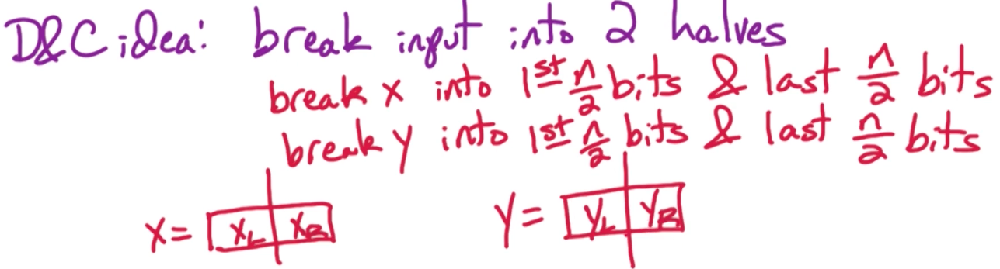
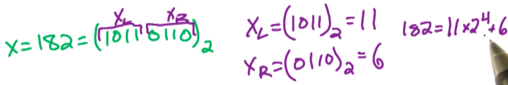
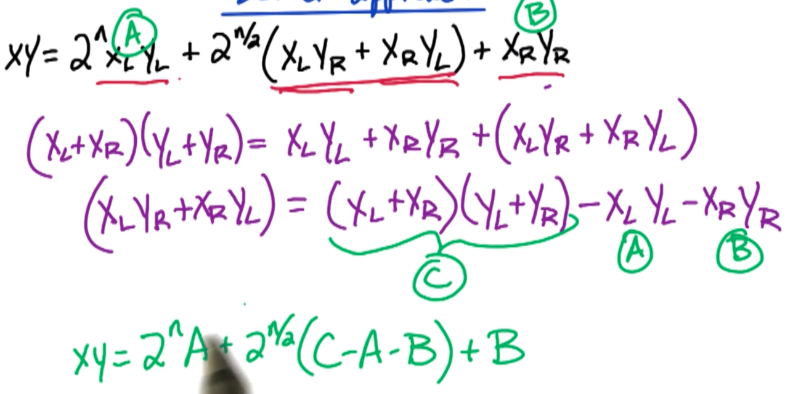

# 1. D&C1 - Complex Multiplication

## 1.0. 问题描述

两个复数，相加相减的时间较为便宜；但是相乘很贵。下面是Guass的想法
$$
(a+bi) \times (c+ di) \\
=ac - bd+ (bc+ad)i
$$
你会发现，我们需要计算4组乘积$ac, bd, bc, ad$

Gauss的想法是将上面$(bc+ad)$表示成$(bc+ad)=(a+b)(c+d)-ac-bd$，这就意味着我们只要计算$(a+b)(c+d);ac;bd$这三个实数乘积即可。那么上面的复数乘积可以表示成：

$(a+bi)\times (c+di)=ac-bd+[(a+b)(c+d)-ac-bd]i$


## 1.1. n-bit Integers Multiplication

假设现在我们有两个 n-bit的正整数$x, y$，例如 1001, 1011。且假设 $n$是2的指数（例如8，16，32等）。如何计算$z=x\times y$的值，并给出算法的时间复杂度？

思路：

我们可以将这两个正整数切分成两半，然后用Divide & Conquer的思想一半一半地相乘。即下图所示。


* 那么$x$就被分成前 $\frac{n}{2}$个 bits 和后$\frac{n}{2}$个bits
* 那么$y$就被分成前 $\frac{n}{2}$个 bits 和后$\frac{n}{2}$个bits

例如，正整数$182 = (1011 0110)_2 = 11\times 2^4 + 6$

其中11 是 1011 （$x_L$）；6是0110 （$x_R$）

那就是说 $x=x_L*2^{n/2}+x_R$；$y=y_L*2^{n/2}+y_R$

$xy=(2^{\frac{n}{2}}x_L+x_R)(2^{\frac{n}{2}}y_L+y_R)=2^n x_L y_L+2^{\frac{n}{2}}(x_L y_R + x_R y_L) + x_R y_R$

这样我们需要计算的乘积有四个,$x_Ly_L, x_Ly_R, x_Ry_L, x_Ry_R$

于是我们有Naive算法的伪码如下：
```
EasyMultiply(x, y):
    input: n-bit integers x and y, n = 2^k
    ouput: z = xy
    x_L = first n/2 bits of x
    x_R = last n/2 bits of x
    y_L = first n/2 bits of y
    y_R = last n/2 bits of y
    A = EasyMultiply(x_L, y_L)
    B = EasyMultiply(x_R, y_R)
    C = EasyMultiply(x_L, y_R)
    D = EasyMultiply(x_R, y_L)
    z = 2^n x A + 2^(n/2) x (C + D) + B
    Return z
```
时间复杂度分析：

首先，计算$x_L, x_R, y_L, y_R$的总时间为$O(n)$。计算$A, B, C, D$的总时间为$4T(\frac{n}{2})$。计算$z$的时间为$O(n)$。所以我们有
$$
T(n) = 4T(\frac{n}{2}) + O(n) = O(n^2)
$$

---
## 1.1. Gaussian Approach

先复习一下时间复杂度的计算，我们有$T(n)=aT(\frac{n}{b})+f(n)$, 其中，
* $a$ 表示每次递归，我们将原问题分成多少个子问题。例如上面的问题中，我们将n-bit integers相乘问题分成4个子问题（要算4个 n/2-bit integers的乘法）。所以$a=4$。
* $b$ 表示每次递归，每个子问题的大小。例如上面的问题中，我们将 n-bit integers 切分成 n/2-bit integers，也就是减半了。所以$b=2$。
* $f(n)$ 表示在递归过程之外所做工作的时间复杂度。例如上面的伪码中，计算 $z$的时间就是$O(n)$，所以$f(n)=O(n)$。

那么通常来说，时间复杂度是 $O(n^{\log_b a})=O(n^{\log_2 4})=O(n^2)$

> NOTE: 更加通用但复杂的计算方法在[这里](https://www.geeksforgeeks.org/advanced-master-theorem-for-divide-and-conquer-recurrences/)


Gaussian的方法：

从上面的Master Theorem和最之前提到的Gauss对于计算两个复数相乘的思路，我们会想，如果能将Master Theorem中的$a$变小，那就可以缩短时间复杂度。由于Gauss的方法只需要计算 3 个 乘子，意味着我们能将原问题 切分成 3 个 子问题（即$a=3$），每个子问题大小为 n/2 (即$b=n/2$)。



```
FastMultiply(x, y):
    input: n-bit integers x and y, n = 2^k
    output: z = xy
    x_L = first n/2 bits of x
    x_R = last n/2 bits of x
    y_L = first n/2 bits of y
    y_R = last n/2 bits of y
    A = FastMultiply(x_L, y_L)
    B = FastMultiply(x_R, y_R)
    C + FastMultiply(x_L + x_R, y_L + y_R)
    z = 2^A + 2^(n/2) x (C - A - B) + B
    Return z
```
时间复杂度：套用前面所的通用公式就是$O(n^{\log_b a})=O(n^{\log_2 3})$


