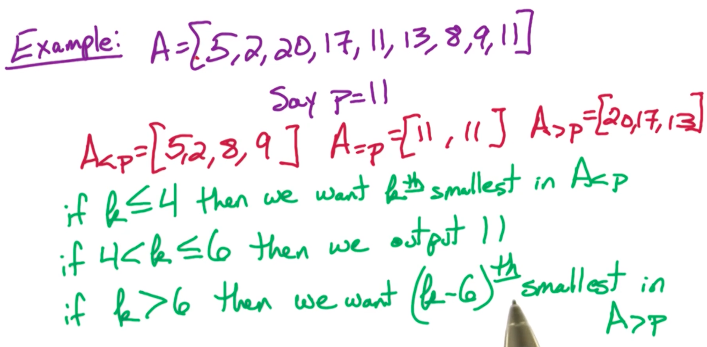
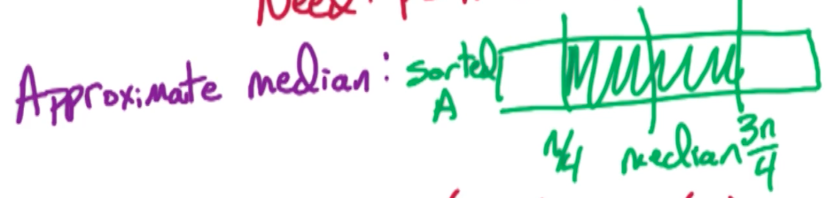
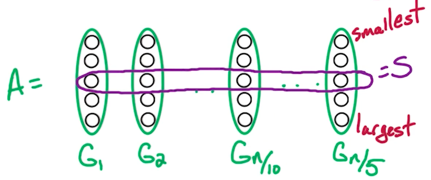
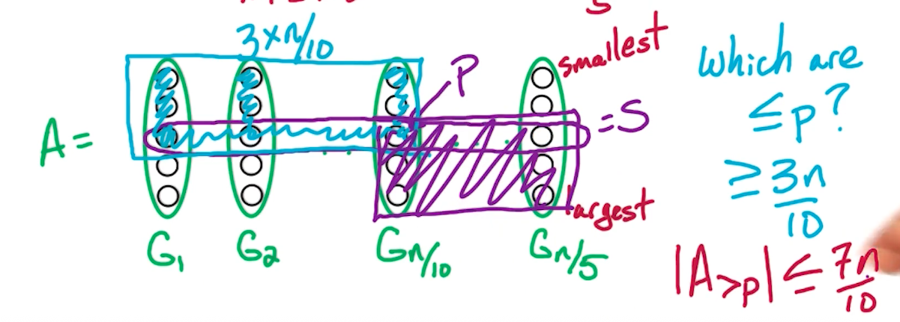

# 2. D&C2 - Linear Time Median

## 2.1. Median Problem

给了一个有$n$个数的unsorted list $A=[a_1, ..., a_n]$，要找到它的median

最直观的方法是sort 一下，然后直接找到 median。

那么有没有更快的方法呢？

我们回想QuickSort算法，它的核心思想是：随机选一个pivot number $p$，然后将原数组分成三份，$A_{<p}, A_{=p}, A_{>p}$，分别存放比$p$小、等于$p$、和大于$p$的数字。看下面例子：



* QuickSort中就是不断将原数组切分成这两（或三）个子数组，然后不断对子数组里面的元素排序
* 这里，我们用的是QuickSelect，也就是不断将原数组切分成这两（或三）个子数组，然后不断对子数组里面的元素进行搜索。于是我们有下面伪码：

```
Select(A, k):
    Choose a poivt number p
    Partition A into A_{<p}, A{=p}, A{>p}
    if k <= |A_{<p}|:
        return Select(A_{<p}, k)
    if |A_{<p}| < k <= |A_{=p}| + |A_{<p}|:
        return p
    if k > |A_{=p}| + |A_{<p}|:
        return Select(A_{>p}, k - |A_{<p}| - |A_{=p}|)
    
```
上面的 $|A_{<p} | $表示 小于$p$的元素的个数。

时间复杂度：$T(n)=T(n/2) + O(n)=O(n^{\log_a b})=O(n^{\log_2 1})+O(n)=O(n)$。

> NOTE: 当$a<b^k$时，等号右边的后半部分$f(n)$变成dominant的项。

什么是Good Pivot？🤔

假设我们有一个已经排好序的数组$A$，好的pivot $p$最好是在 第 $\frac{1}{4}n$ 到 $\frac{3}{4}n$之间。为什么呢？🤔

我们回想QuickSelect算法，理想情况下，pivot $p$正好能将原未排序的数组$A$等分成两份，这样能保证recursion出来的子问题大小相等。但通常情况来说很难等分。所以我们认为，如果pivot $p$值能在第 $\frac{1}{4}n$大 到 $\frac{3}{4}n$大 之间就算是好的pivot（如下图）。



我们分别看几个pivot $p$的关键点：
* $p$在 $\frac{99n}{100}$处： 时间复杂度$T(n)=T(\frac{99n}{100}) + O(n)=O(n)$
* $p$在 $\frac{n}{100}$处： 时间复杂度$T(n)=T(\frac{99n}{100}) + O(n)=O(n)$
* $p$在 $\frac{n}{4}$处： 时间复杂度$T(n)=T(\frac{3n}{4}) + O(n)=O(n)$
* $p$在 $\frac{3n}{4}$处： 时间复杂度$T(n)=T(\frac{3n}{4}) + O(n)=O(n)$
* $p$在 $\frac{n}{2}$处： 时间复杂度$T(n)=T(\frac{n}{2}) + O(n)=O(n)$

那么我们总结一下， 当$p$满足 $|A_{<p}| \leq \frac{3n}{4}$ 且$|A_{>p}| \leq \frac{3n}{4}$ 的时候，$p$就是Good Pivot。那我们怎么确保$p$是个 Good Pivot呢？🤔

比较常见的方法就是从原数组$A$里随机挑选一个$p$，那也就是说有一半的概率挑到 Good Pivot；另一半是Bad Pivot。
* 如果幸运，挑到了Good Pivot，那就继续算法
* 如果不幸挑到了Bad Pivot，那我们可以再挑一次，直到挑到Good Pivot为止。如果非常不幸，这似乎并不能 “保证”挑选到Good Pivot，怎么办？🤔

首先我们的QuickSelect算法的时间复杂度是$T(n)=T(\frac{3n}{4}) + O(n) = O(n)$（在挑选到Good pivot的前提下）。最坏情况下，我们希望在$O(n)$的时间内找到Good Pivot。又因为我们知道，只要能确保$T(\frac{3n}{4})$的系数$\frac{3}{4}<1$，那么$T(n)$就是$O(n)$时间的，所以，我们可以额外匀出来$T(0.24n)$用来找到Good Pivot，于是，用来找Good Pivot的时间就成了$T(0.24n)+O(n)$。这样一来，QuickSelect算法的时间复杂度变成：$T(n) = T(\frac{3n}{4}) + T(\frac{n}{5}) + O(n)$ 其中$T(\frac{n}{5}) + O(n)$的时间用来找到Good Pivot。

> NOTE: $\frac{3}{4}+\frac{1}{5}=\frac{19}{20}<1$，这保证了最后$T(n)=O(n)$

哪位体在于我们怎么用好这多出来的$T(\frac{n}{5})$时间呢？🤔

我们要选一个$A$的子集$S$，使得该子集的元素个数$|S|=\frac{n}{5}$。然后让$p=\textbf{Median}(S)$。 那么这个子集$S$又该怎么找？🤔

Naive的想法是简单取$A$的最前面的$\frac{n}{5}$个元素作为$S$，然后我们取$\textbf{Median}(S)$的话就相当于取$A$中第$\frac{n}{10}$大的元素作为$p$。如果$A$本身就是排好序的数组，那这显然不是一个Good Pivot。这怎么办？🤔

这要回到我们选$S$子集的初衷。我们希望找到一个子集$S$，使得$S$能一定程度上代表原数组$A$。具体来说我们希望对于每个$x\in S$ ，有：
* a few elements of A are $\leq x$，且
* a few elements of A are $\geq x$

具体来说，我们可以将$A$分成$\frac{n}{5}$组，每组有 5个元素，我们暂时用$G={x_1, x_2, x_3, x_4, x_5}$来表示。然后对这5个元素排序，得到：$x_1\leq x_2 \leq x_3 \leq x_4 \leq x_5$，然后得到这5个元素的 Median $x_3$。这个$x_3$对于这一组元素$G$来说就是"representative"有代表性的，同时$x_3$也是一个Good Pivot

> NOTE: 注意，无论对这5个元素用什么样的方式进行排序都不会影响到算法最后的时间复杂度。因为$O(5^{100})=O(1)$。

伪码如下：
```
FastSelect(A, k):
    1. Break A into 5/n groups, G_1, G_2, ... G_{n/5}
    For i = 1 -> n/5:
        sort G_i
        let m_i = Median(G_i)
    Let S = {m_1, m_2, ..., m_{n/5}}
    p = FastSelect(S, n/10)
    Partition A into A_{<p}, A_{=p}, A_{>p}
    if k <= |A_{<p}|:
        Return FastSelect(A_{<p}, k)
    if k > |A_{<p}| + |A_{=p}|:
        Return FastSelect(A_{>p}, k - |A_{<p}| - |A_{=p}|)
    else:
        Return p
```

时间复杂度：

1. 第一步 Break A需要 $O(n)$时间
2. 对 n/5 组 $G_i$进行排序需要 $O(n)$ 时间
3. FastSelect(S, n/10) 这一步递归需要 $T(\frac{n}{5})$的时间，因为$S$的大小是$\frac{n}{5}$。
4. 之后的parition的时间是$O(1)$
5. 最后的recursion时间是$T(\frac{3n}{4})$

那么总的时间是$T(n)=T(\frac{3n}{4})+T(\frac{n}{5})+O(n) = O(n)$

到此为止我们还需要回答一个问题：如何证明$p$就是Good Pivot？🤔

首先我们有$\frac{n}{5}$组，每组有5个元素。然后我们按照每组的median大小对每组排序。如下图所示：



$p$，也就是$G_{\frac{n}{10}}$这一组的median 是不是Good Pivot？答案是 “是”。这也叫 "Median of Median"。回想之前的定义：我们希望找到一个Good Pivot $p$，使得对于每个$x\in S$ ，有：
* a few elements of A are $\leq x$，且
* a few elements of A are $\geq x$

从下图不难看出，一定小于$p$的元素，也就是左上角的 $3\times \frac{n}{10}$个；一定大于$p$的元素是右下角$3 \times \frac{n}{10}$个。



到此我们完成了对该算法的证明过程。


