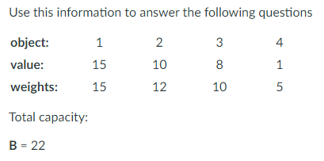

# 1. Knapsack Problem

这类问题常见的 input就是有 n 个选项，每个选项有
* integer weights $w_1, ... w_n$
* integer values $v_1, ..., v_n$
* total capacity $B$

目标是找到一组 subset使得：
1. $\sum_{i\in S}w_i \leq B$ （subset的重量不超过限制）
2. $\max \sum_{i \in S} v_i$  （且subset的总价值最高）


这个问题常见的两个版本：
1. 每个选项只能选一次
2. 每个选项可以选无数次

## 1.1. Knapsack Problem with No Repeat
看下面的案例，我们想要找到 总重量不超过22 ，且能够最大化 value的 objects的集合。



我们用$k(i)$ 表示 在第一个到第 $i$ 个object中能够达到的 重量不超过22 的最大value。也就是说我们有下面的 $k$值：

|       | $i=0$    | $i=1$ | $i=2$ | $i=3$ |
| ----- | -------- | ------- | ---- | ---- |
| values | 15  | 10    | 8 | 1 |
| weights | 15 | 12     | 10 | 5 |
|      $k$ | 15    | 15    | 18 | 19 |

<span style="color:cyan">你会发现</span> $k$ <span style="color:cyan">值在从 </span> $i=1$ <span style="color:cyan">到</span> $i=2$ <span style="color:cyan">的时候需要用前面的 suboptimal (也就是10)，而不是optimal (15)</span>。 <span style="color:red">这就给算法造成了麻烦</span>。<span style="color:green">所以我们需要定义一个 "weight capacity"，它应当随着目前为止的</span> $i$ <span style="color:green">而变化</span>。

传统的递推应该是：to solve $k(i)$，我们需要使用 $k(i-1)$。这我们刚刚发现不work，因为我们需要额外的限制条件，即 total weight $\leq B- w_i$。也就是说我们需要两个参数，一个是$i$，一个是$b$，那也就是需要一个2D表。于是我们有下面对于子问题的伪码逻辑：
```
For i & b where 0 <= i <= n & 0 <= b <= B:
    let k(i, b) = max value achievable using a subset of objects 1,..., i & total weight <= b

goal: compute k(n, B)
```
总结来说，有两种情况：
1. if $w_i <= b$: then $k(i,b)=\max{v_k+k(i-1,b-w_i), k(i-1,b)}$ 也就是说如果要么就是算上当前的object i；要么就是不要当前的object i.
2. if $w_i > b$: then $k(i,b)=k(i-1,b)$ 否则，我们直接继承前一个 i 的结果

base case - $k(0, b)=0, k(i, 0) = 0$

于是我们有下面的伪码：
```
Knapsack No Repeat(w1, ..., wn, v1, ... vn, B):
    for b = 0 -> B: k(0, b) = 0
    for i = 1 -> n: k(i, 0) = 0
    for i = 1 -> n:
        for b = 1 -> B:
        if wi <= b:
            k(i, b) = max{vi + k(i-1, b - wi), k(i-1, b)}
        else:
            k(i, b) = k(i-1, b)
    Return k(n, B)
```

对于Knapsack算法，不难看出他的time complexity = $O(nB)$。
> 问题： 那么这个时间复杂度是不是input size $n$ 和 $B$ 的多项式表达？
> 思考：要回答这个问题，首先要看 $n$ 和 $B$ 。这里的$B$ 其实只是一个数。数字本身是以二进制的形式存在计算机里的，所以$B$所需要的空间就是 $\log B$。那么该算法运算时间足够有效的多项式表达应该是$O(n\log B)$。所以该问题的答案是：No。

类似于Knapsack这样无法在 input的多项式 时间内求解的问题，就是NP-complete 问题

---

## 1.2. Knapsack Problem with Unlimited Repeat

类似的，该问题问的是，在可以无限次重复挑选object的情况下，如何找到一组object的subset，使得该subset的总重量不超过限制$B$，且能让总价值最大？

我们借用上一个问题的递推公式，
$k(i, b) = \max\{k(i-1, b), v_i + k(i, b-w_i)\}$

其中，
* $k(i-1,b)$就表示不再将当前 object $i$ 加入到subset里 时的总价值。
* $v_i+k(i, b-w_i)$ 表示选用 object $i$ 加入到subset里 时的总价值。

<span style="color:red">注意这里使用的是</span> $k(i, b-w_i)$，<span style="color:red">因为这表示你可以重复使用当前object </span> $i$ 。我们检查一下二维DP表，发现计算当前格 $k(i,b)$ 所需要的格子已经在前面计算过了，所以这是有效的递推公式。意味着该问题只需要在上一个问题的伪码的基础上做一点点改动即可。

于是我们有下面的伪码：
```
Knapsack Repeat(w1, ..., wn, v1, ... vn, B):
    for b = 0 -> B: k(0, b) = 0
    for i = 1 -> n: k(i, 0) = 0
    for i = 1 -> n:
        for b = 1 -> B:
        if wi <= b:
            k(i, b) = max{vi + k(i, b - wi), k(i-1, b)}
        else:
            k(i, b) = k(i-1, b)
    Return k(n, B)
```

在此基础上，我们还可以进一步将二维DP表 缩减成 一维，递推公式是：$k(b)=\max_i \{v_i+k(b-w_i) | 1 \leq n; w_i \leq b \}$ 。伪码如下：

```
Knapsack Repeat(w1, ..., wn, v1, ..., vn, B):
    for b = 0 -> B:
        k(b) = 0
        for i = 1 -> n:
            if wi <= b & k(b) < vi + k(b - wi):
                k(b) = vi + k(b - wi)
    Return k(B)
```
时间复杂度还是$O(nB)$，但是空间复杂度变成 $O(B)$。


---

# 2. Chain Matrix Multiply (CMM)
该问题要找到 矩阵链式相乘时 所需要的最小运算时间。

现在有$A_1, A_2, ..., A_n$矩阵。它们的大小分别是$m_0\times m_1, m_1 \times m_2, ..., m_{n-1}\times m_n$。

该问题的input是$m_0, m_1, ..., m_n$。

## 2.1. Attempt 1 to CMM

首先我们尝试找到subproblem。我们让$c(i)$表示计算$A_1\times A_2\times ... \times A_i$所需要的最小时间。我们用一个二叉树表示如下：

* 根结点就是计算$A_1\times A_2\times ... \times A_n$；
* 左节点是计算$A_1\times A_2\times ... \times A_i$；
* 右节点是计算$A_{i+1}\times A_2\times ... \times A_n$；
* 以此类推...

但是你会发现我们需要计算右节点的两个字节点$A_{i+1}\times A_{i+2}\times ... \times A_j$和$A_{j+1}\times A_{j+2}\times ... \times A_n$。这两个节点 该如何得到？

在这种定义下，我们将有两个参数$i, j$。我们定义$c(i, j)$为计算$A_i\times A_{i+1}\times... \times A_j$的最小花销。那么我们要找到$c(i,j)$的递推公式。但至少我们知道$c(i,i)=0$。

我们看一下该如何计算前面提到的$A_{i+1}\times... \times A_j$，如下图：

我们用$l$ 遍历 $A_i\times ... \times A_j$，然后通过查DP表，找到计算$A_{i}\times... \times A_l$和$A_{l+1}\times... \times A_j$的最小开销。$A_{i}\times... \times A_l$的最小花销是$m_{i-1}\times m_l$；$A_{l+1}\times... \times A_j$的最小开销是$m_l\times m_j$。
* $A_i\times ... \times A_j$ 开销： $m_{i-1} \times m_l \times m_j$
* $A_{i}\times... \times A_l$开销：$c(i,l)$
* $A_{l+1}\times... \times A_j$开销： $c(l+1, j)$

所以递推公式是：
$c(i,j)=\min_l \{c(i,l) + c(l+1, j) + m_{i-1} m_l m_j| i \leq l \leq j-1 \}$

在我们写伪码之前需要先看一下， DP表是如何填写的，如下图

* base case是对角线 - $c(i,i)=0$
* 然后填写对角线上方的对角线② $c(i,i+1)$
* ...
* 最后填写DP表最右上角的元素 $c(1, n)$

伪码：
```
ChainMultiply(m0, m1, ..., mn):
    For i = 1 -> n:
        c(i, i) = 0
    For s = 1 -> n-1:
        For i = 1 -> n-s:
            Let j = i + s
            c(i, j) = ∞
            For l = i -> j-1:
                curr_cost = m_{i-1} x m_l x m_j + c(i,l) + c(l+1,j)
                if c(i,j) > curr_cost
                    c(i, j) = curr_cost
    Return c(1, n)
```
时间复杂度为：$O(n^3)$

## 2.2. DP2 Addendum

推荐的练习题
- [DPV] 6.17 (换钱问题)
- [DPV] 6.18 (换钱问题变种)
- [DPV] 6.19 (换钱问题变种)
- [DPV] 6.20 (optimal BST问题)
- [DPV] 6.7 (Longest Palindrome Subsequence问题和 Longest Palindrome Substring问题)

<span style="color:cyan">总结：对于subproblem的寻找，首先要找prefix，然后尝试substrings。当你发现substrings的方法可行时，你可以回过头来再看一下，是否prefix也可行。</span>


