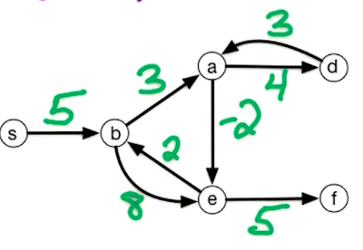
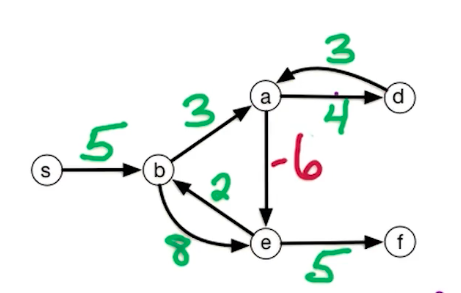
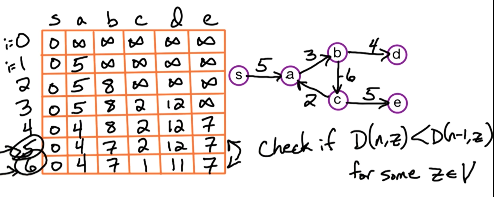
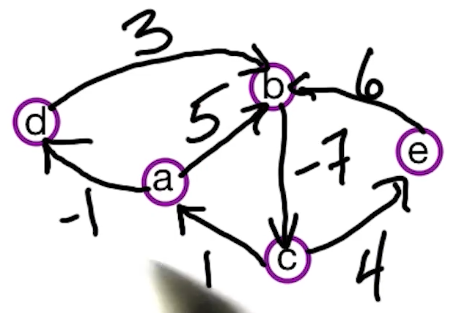
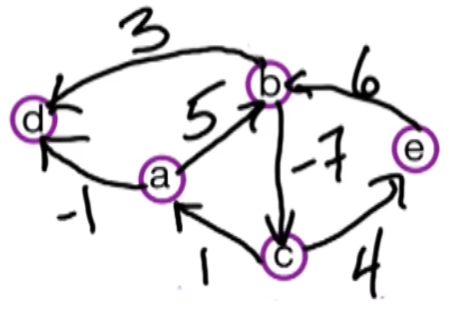

# 3. DP3 - Shortest Path Problem

## 3.0. 问题描述：

在一个有向有权图$\vec{G}=(V, E)$中，边的权重是$w(e)$。起点固定为$s$，我们希望找到从$s$到每个剩余节点的最短路径。



最经典的算法是Dijkstra's Algorithm
* 优点是：快
* 缺点是：无法处理某条边的权重为负的情况
* 运算时间：$O((n+m)\log(n))$

所以这章就不看Dijkstra's Algorithm，而是其他的算法

---

我们用下面的图为例， a -> e -> b 就是一个negative cycle，无限次循环通过，都可以让总路径的总权重 -1 




## 3.1. DP - Single Source

我们先假设 有权有向图$\vec{G}$中没有negative cycle。由于没有negative cycle, 所以最终的最短路径$P$一定经过每个节点最多一次 (<=1次)。这样就能推导出 $|P|<= n-1$ （边的个数 <= n-1），$n$是图$\vec{G}$中节点的个数
> **_HINT:_** 因为没有 负环，所以最短路中不会有环，所以最终 s -> z 的最短路径里最多有 n-1 个边

> DP idea -> 我们可以使用 $i=0 \rarr n-1$ 条边。也就是用 $i$来进行一个递推。

```
For (0 <= i <= n-1) & (z in V):
    let D(i, z) = length of shortest path
```

其中 $i$表示 最短路径上的第$i$个边， $z$表示 节点的数量
$D(i, z)$表示：在有最多$i$条边的时候，从 节点$s$ 到 终点$z$的最短路径长度的函数。


### 3.1.1. DP - Recurrence for Single Source Shortest Path Problem

有了上面的推导，不难看出Base Case是当我们选用0个边，起点终点都是 $s$的时候，$D(0,s)=0$。同时我们还知道，当只选用 0条边的时候，从$s \rarr z$应该是$D(0, z)=\infty$。

递推公式：我们要看当我们只选用 $i$条边的时候，$s \rarr z$的最短路径是多少。我们假设 $y$是最短路径$P$上 终点$z$的前一个点（如下图）。那么$s \rarr y$就是有 $i-1$条边。那我们通过问题本身的“shortest”联想到，假设从 $y$到$z$ 有很多边，我们需要找到的是这很多边中的最短（“Shortest”）的一条。于是，我们用 $D(i-1,y)$ 来表示$D(i,z)$，就有

$D(i,z) = min_{\vec{yz}\in E}\{ D(i-1,y) + w(y, z) \}$


最后，我们不仅要看递推公式，还需要用$D(i,z)$与前一个solution $D(i-1,z)$对比取最小。<span style="color: cyan">所以最终的递推公式为：</span>
$D(i,z) = \min\{ D(i-1,z), \min_{\vec{yz}\in E}\{ D(i-1,y) + w(y, z) \} \}$

### 3.1.2. Bellman-Ford
上面讲的就是 Bellman-Ford Algorithm，这俩人也是想出dynamic programming的。伪码如下：
```
Bellman-Ford(G, s, w):
    for all vertex z in V:
        D(0, z) = inf
    
    D(0, s) = 0

    for i = 1 -> n - 1:
        for all vertex z in V:
            D(i, z) = D(i-1, z)
            for all edge yz in E:
                if D(i, z) > D(i-1, y) + w(y, z)
                    D(i, z) = D(i-1, y) + w(y, z)
    return D(n-1, .)
```

时间复杂度：$O(nm)$
 > NOTE: 对于上面算法的时间复杂度来说，最外层的 for 循环是 $O(n)$。最内部的两个 for 循环放在一起的时间复杂度是 $O(m)$，这是因为这两个 for循环 完成了一次对于所有边的遍历

> NOTE: Bellman-Ford算法是慢于 Dijkstra Algorithm，但是允许图中存在 “负环”。同时，该算法还能够找到 “负环”。我们将在下面讲解。

### 3.1.3. Finding Negative Weight Cycles

> 💡Idea： 这里的想法非常简单，就是在之前Bellman-Ford算法的基础上多跑一次循环，这样DP表就多一行。然后用多出的这最后一行 与 倒数第二行column-wise对比，如果有哪个元素比倒数第二行小，就说明有Negative Cycle。否则就没有。

仔细看下图中的最后两行。其中第六行是在Bellman-Ford算法的基础上额外加的一行，这一行与 倒数第二行column-wise对比，如果有哪个元素比倒数第二行小。这个最后一行较小的元素就是由negative cycle造成的。



---

## 3.2. DP - All-pairs Shortest Path

问题描述：该问题是要找到有向有权图$\vec{G}$中每两个节点之间的最短路径。

最直观的方法：有了Bellman-Ford算法，最直观的方法就是我跑$n$次该算法，找到所有起点$s$到终点$z$的最短路径。那么因为有$n$个节点，所以最终的运算时间是$O(n^2m)$。

更快的方法：在Bellman-Ford算法中，我们使用了 $i$ 和 $z$作为两个 prefix，分别表示能够使用的最多边数$i$ 和 当前终点$z$。在这次的问题中，我们要找所有节点对 之间的最短距离，所以自然而然想到要再引入一个 prefix 表示当前节点。最终我们有三个prefix：

1. 起点$s$
2. 终点$t$
3. 从起点$s$到终点$t$之间经过的中间节点的集合 $\{1, ..., i\}$。其中$i$是中间节点的最大个数

那么DP表将会是一个三维的表格 $D(i, s, t)$，表示从节点$s$到节点$t$ 在只使用节点集合$\{1, ..., i\}$的情况下的最短路径。其中$0 \leq i \leq n; 1 \leq s \leq n; 1 \leq t \leq n$

### 3.2.1. DP - Recurrence

Base Case: 
1. 当使用仅一条边，且 $s, t$不同，且存在$w(s,t)$，则$DP(1, s, t) = w(s, t)$
2. 当使用仅一条边，且 $s, t$不同，但不存在$w(s,t)$，则$DP(1, s, t) = \infty$

递推公式：
递推公式无非就是要通过$i-1$来表示$i$。此时有两种情况：
1. 一种是我们使用$\{1, ..., i-1\}$这个节点集合；
2. 另一种是使用$\{1, ..., i\}$这个节点集合。

那也就是要讨论节点$i$在与不在的情况。
1. 当节点$i$不在最短路径$P$上， 意味着只使用节点集合 $\{1, ..., i-1\}$，所以$D(i,s,t)=D(i-1, s, t)$
2. 当节点$i$在最短路径$P$上，这时我们可以将最短路径抽象成$s \rarr \{1, ..., i-1 \} \rarr i \rarr \{1, ..., i-1\} \rarr t$。也就是说，最终的最短路径是从$s$到节点集合$\{1, ..., i-1 \}$，然后经过了$i$节点，然后可能会再经过 $\{1, ..., i-1 \}$节点集合，最终到达终点$t$。那么这种情况下的递推公式是：$D(i, s, t) = D(i-1, s, i) + D(i-1, i, t)$

最终的递推公式：$D(i, s,t)=\min\{D(i-1,s,t), D(i-1,s,i)+D(i-1,i,t)\}$

伪码：
```
Floyd-Warshall(G, w):
    For s = 1 -> n:
        For t = 1 -> n:
            if edge st in E, then D(0, s, t) = w(s, t)
            else D(0, s, t) = inf
    
    For i = 1 -> n:
        For s = 1 -> n:
            For t = 1 -> n:
                D(i, s, t) = min{D(i-1,s,t), D(i-1,s,i)+D(i-1,i,t)}
    
    Return D(n, ., .)
```
时间复杂度：$O(n^3)$，$n$是节点个数。

### 3.2.2. DP - What if there are Negative Cycles?

<span style="color:cyan">Floyd-Warshall 算法假设有向有权图</span>$\vec{G}$<span style="color:cyan">中是没有 “负环”的。如果有的话，该算法不work</span>。那么用该算法如何能找到“负环”呢？我们以下图为例，


Floyd-Warshall的DP表中 $D(n,a,a)$是多少？——$D(n,a,a)=-1$。因为从$a$到$a$的最短路径就是 $a \rarr b \rarr c$这个负环。

所以我们就只要遍历DP表的对角线元素$D(n, y, y)$，如果有$D(n, y, y)<0$那就是有负环。


## 3.3. DP - Bellman-Ford vs. Floyd-Warshall

我们将上面图中$bd$边反向得到下图：



你会发现如果选用$d$ 节点作为起点，那么Bellman-Ford算法就不能找到负环了。这是因为该算法只能找到从起点开始，到所有reachable节点之间的负环。

相比之下，Floyd-Warshall算法就没有这样的限制，就是因为它寻找的是All-pair的


## 3.4. DP - Extra Homework DPV 4.21 (Currency Exchange)


