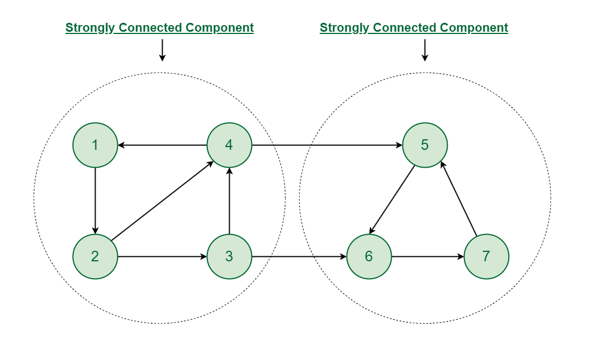
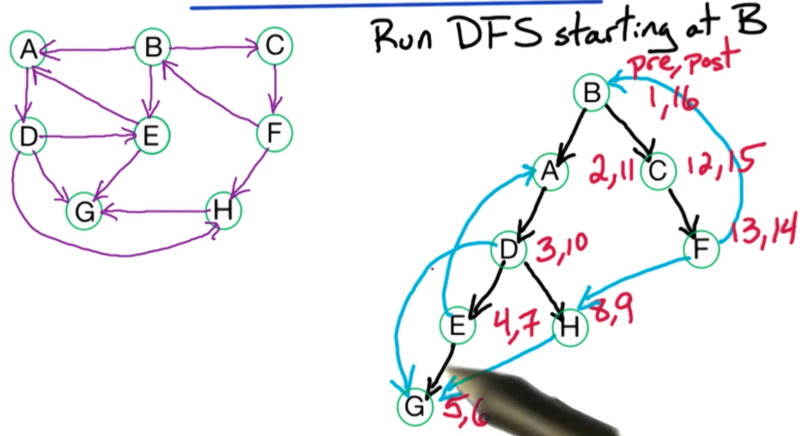
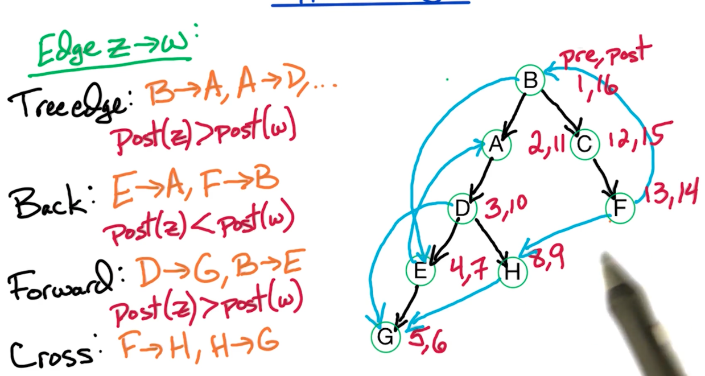
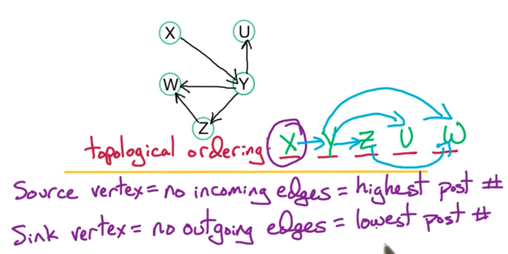
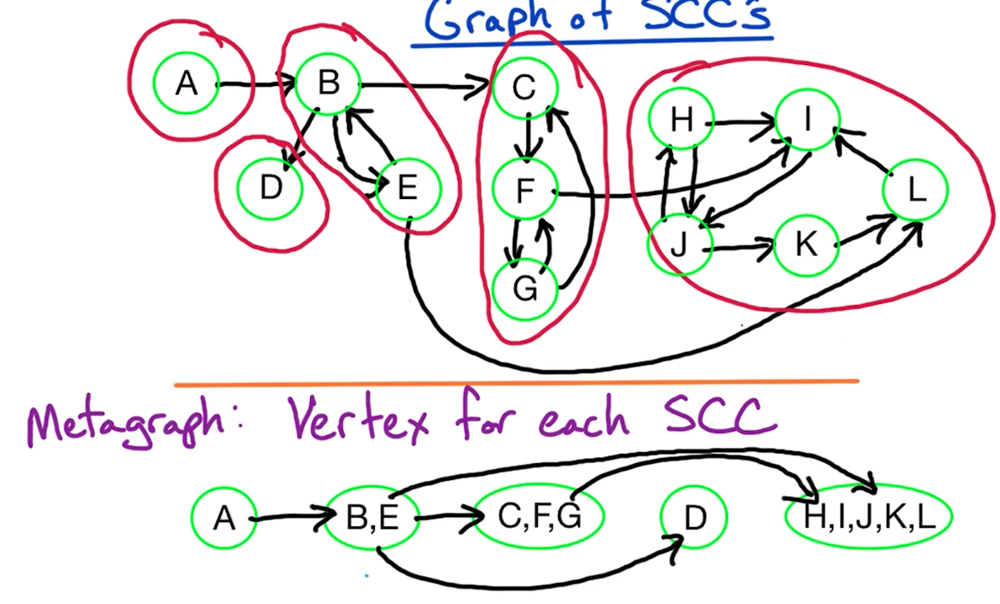
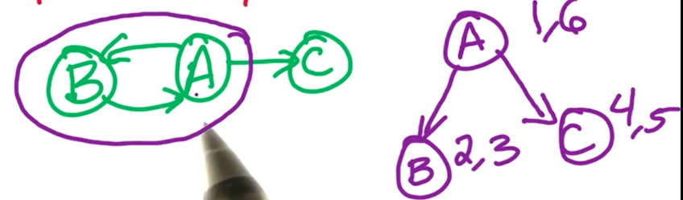
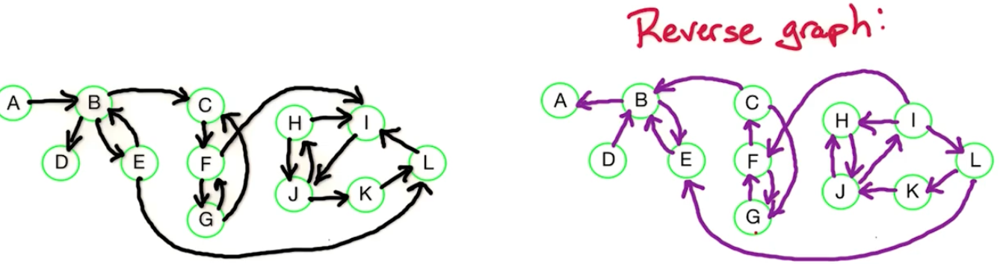
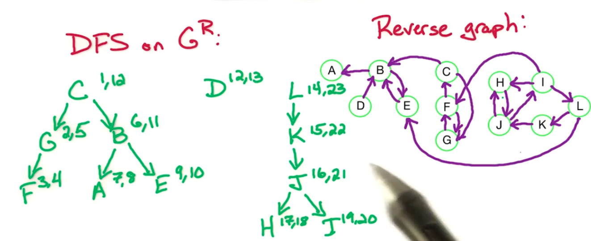
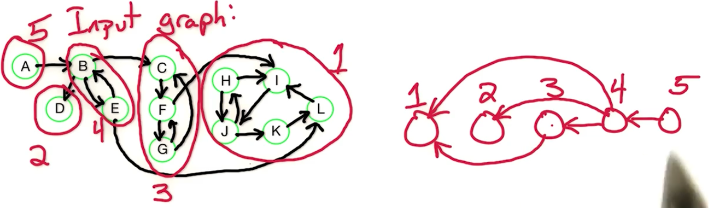

# 5. Graph - Strongly Connected Component

术语：
* Connected Component - <span style="color:cyan">是无向图中一组节点集合，每个节点之间都是相互可达的</span>
* Strongly Connected Component - <span style="color:cyan">是有向图中一组节点的组合，这些节点之间都是互相可达的</span>


所以根据定义不难看出，无向图中Connected Component类似于一个个“孤岛”，非常直观就能看出来。因此，多数研究都着眼于Strongly Connected Component（如上图）。上图中，两个components之间虽然存在边 相连，但并不能保证每两个节点之间都是可达的。

## 5.1 🤔如何找到无向图$G$中的 Connected Components？

答案：Run DFS & Keep track of component number

伪码：
```
DFS(G):
    input: G = (V, E) in adjacency list representation
    output: vertices labelled by connected components
    cc = 0
    for all v in V:
        let visited(v) = False
    for all v in V:
        if not visited(v), then:
            cc++
            Explore(v)

Explore(z):
    ccnum(z) = cc
    visited(z) = True
    for all (z, w) in E:
        if not visited(w)
            then Explore(w)
```
时间复杂度：$O(n+m)$，其中$n=|V|, m=|E|$

## 5.2. 如何更新 pre和post？
首先 pre 和 post分别表示 dfs在遍历图的时候的顺序。如果是前序遍历，就记录在pre；如果是后序遍历，就记录在post。例如：

假设以 B 节点为起点开始dfs遍历，我们默认优先遍历字母序靠前的节点。最终的遍历顺序、pre、post的值如上图所示。

**边的种类：** <br>
对于边 $z \rarr w$来说：<br>
* Tree edge: B -> A; A -> D; ...; 黑色的 post(z) > post(w)
* Back edge： E -> A; F -> B; ...; post(z) < post(w)
* Forward edge：D -> G; B -> E ...  post(z) > post(w)
* Cross edge：F -> H; H -> G ...  post(z) > post(w)

| Tree edge | Back edge | Forward edge | Cross edge |
| :-------: | :----------: | :-------: | :--------: |
| B -> A; A -> D ... | E -> A; F -> B ... | D -> G; B -> E ... | F -> H; H -> G ... |
| post(z) > post(w) | post(z) < post(w) | post(z) > post(w) | post(z) > post(w) |

<p></p>


根据之前提到的伪码，我们如何获得每个节点的pre呢？—— pre就是前序遍历的顺序，所以我们只需要在“每个节点第一次被遍历到”的时候记录下顺序就行了。同理，post就是当“完成对当前节点所有边的遍历”时，该节点被遍历的顺序。那就有下面的伪码：
```
DFS(G):
    input: G = (V, E) in adjacency list representation
    output: vertices labelled by connected components
    clock = 1                       <--- 初始化
    for all v in V:
        let visited(v) = False
    for all v in V:
        if not visited(v), then:
            Explore(v)

Explore(z):
    pre(z) = clock                  <--- 每次刚开始对某个节点遍历
    clock++
    visited(z) = True
    for all (z, w) in E:
        if not visited(w)
            then Explore(w)
    post(z) = clock                 <--- 完成对某个节点的遍历
    clock++
```

---

## 5.3. Cycles

回想一下几种边的特性：
| Tree edge | Forward edge | Back edge | Cross edge |
| :-------: | :----------: | :-------: | :--------: |
| B -> A; A -> D ... | E -> A; F -> B ... | D -> G; B -> E ... | F -> H; H -> G ... |
| post(z) > post(w) | post(z) < post(w) | post(z) > post(w) | post(z) > post(w) |

🤔然后我们有这个陈述：<span style="color: cyan">G has a cycle iff its DFS tree has a back edge</span>。该陈述是正确的✅，而且 <span style="color: cyan">反之亦然，当且仅当DFS tree上存在一个back edge的时候，图G有cycle</span>。

> NOTE: 证明略。相见：https://edstem.org/us/courses/78610/lessons/138111/slides/778811

## 5.4. DAG and Topological Sorting

DAG = Directed Acyclic Graph，也就是有向无环图。上面刚讲了，"DFS tree中有没有back edge" 是 "图G中有没有cycle"的充要条件。所以DAG的DFS tree中一定没有 back edge。进一步意味着，如果我们看post值，会发现所有的 post(z) > post(w)，即post值随着遍历深度递减。

<span style="color: cyan">Topological Sort：将所有节点按照其 post值 降序排序</span>。这将需要$O(n+m)$时间

下图中，有三种拓扑序：1. XYZWU； 2. XYUZW； 3. XYZUW。<br>
Z节点一定在W节点之前


对于最终的拓扑序，排名最高的(X)称为 Source；最低的(U或W)称为Sink。

另一种进行拓扑排序的方法是：
* 不断找到图中的 sink节点放到拓扑序的最后。
* 去掉当前 sink节点，然后找剩余图 中的sink节点放到拓扑序最后
* 如此重复，直到图 为 空

🤔那怎么找到图中的sink节点？——我们之后会给出方法


## 5.5. Connectivity in Directed Graphs

我们知道，如果两个节点 v, w在同一个 SCC中的话，那么一定有： v -> w和 w -> v这两条边。假设现在有下面的有向图，我们标注出SCC，然后构建一个metagraph



我们会发现这么几个有趣的性质：
1. metagraph最终也是DAG
2. 每个有向图都是它的SCC的 DAG

现在我们可以来尝试回答上面这个问题：🤔那怎么找到图中的sink节点？

答案：<br>
我们发现sink节点只有 往里进的边；source节点只有 向外出的边。

🤔问题：如何找到有向图中的SCC？<br>
方法类似于用sink vertex找每个节点的拓扑序。这里，我们找Sink Component，然后去掉当前sink component，再找剩余图的sink component。如此类推。

🤔为什么找Sink Component而不是Source Component？—— 因为Sink Component能保证 随便挑一个节点然后进行DFS后，不会遍历到其他的Component里，而仅仅只是在当前所选中的节点 所在的Component中遍历节点。例如上图，假设我们选了Sink Component中的 H点，那么只有H, I, J, K, L会被遍历到。如此，我们就知道，这些被遍历到的节点都在Sink Component里。

⚠️注意，post最低的节点并不一定在Sink SCC中。例如下图中的B，post(B) = 3，但是B节点在Source SCC中


但 <span style="color:cyan">post最高的节点 一定在 Source SCC中</span>

---

🤔已知一个有向图，如何找到Sink SCC中的节点 w？

思路：首先我们知道Sink SCC不太好确定，但Source SCC好确定，因为post最高的节点一定在Sink SCC里。

1. 反向所有边： $G(V, E) ==> \text{reverse of G} = G^R=(V, E^R)$。原图G中的Source SCC 就是反图中的Sink SCC。同理，原图G中的Sink SCC就是反图中的Source SCC
2. 那么要找原图G中的Sink SCC的一个节点，我们就可以找反图$G^R$中的Source SCC。所以我们就对$G^R$跑一个DFS，找到post最大的（也就是 Source SCC） 

所以在这个例子中（如下图），如何找到{H,I,J,K,L}这个Sink SCC的节点？

我们把原图反向，在反图里，利用<span style="color: cyan">反图里的Source SCC都是原图里的Sink SCC</span>这一性质，我们发现反图里只有两个Source SCC, {H,I,J,K,L}和{D}。那我们就跑一个DFS，这里假设我们挑到了节点C开始跑DFS于是，我们有下面的DFS tree：

先对 C遍历，然后对D，最后对 L （这里对L和D 遍历的顺序可以互换）。发现post 最大的是L这个tree，意味着这个树就是反图的Source SCC，那就是原图的Sink SCC。

post order ⬇️: L, K, J, I, H, D, C, B, E, A, G, F

有了这个排序我们就可以从 L 开始，用DFS遍历原图。于是我们会遍历：
* L, K, J, I, H （并标记为“已遍历“，同时归于 SCC1）
* D（并标记为“已遍历”，同时归于 SCC2）
* C, G, F（并标记为“已遍历”，同时归于 SCC3）
* B, E （并标记为“已遍历”，同时归于 SCC4）
* A （并标记为“已遍历”，同时归于 SCC5）

在上面DFS遍历的过程中，如果我们有对 “边”进行追踪 是否遍历过 的话，会发现此时会剩余几个没有遍历过的边，这几个边恰好就是 metagraph中链接SCC之间的边。如下图所示，我们画出来5个SCC和剩余的5条边，发现：
* 最后遍历到的SCC （SCC5）就是原图的Source SCC
* 最先遍历到的就是原图的 Sink SCC


伪码：
```
SCC(G):
    input: directed G = (V, E) in adjacent list
    1. Construct reverse graph G^R
    2. Run DFS on G^R
    3. Order all vertices V by post order decreasingly
    4. Run undirected Connected component algorithm on G
```
上面第四步 Undirected Connected Component algorithm 如下：
```
DFS(G):
    cc = 0
    for all v in V:
        visited(v) = False
    for all v in V:
        if not visited:
            c++
            Explore(v)

Explore(z):
    ccnum(z) = cc
    visited(z) = True
    for all (z, w) in E:
        if not visited(w):
            Explore(w)
```
SCC 算法时间复杂度为: $O(n+m)$，因为相当于跑了两次DFS，每次DFS需要$O(n+m)$时间。


