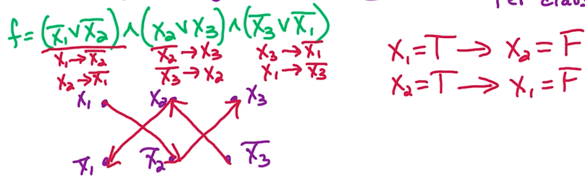
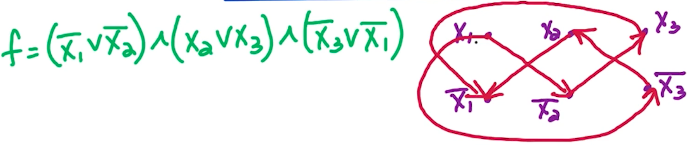

# 6. SAT Problem
## 6.0. 问题描述

问题说的是布尔运算，说有$n$个变量$X_1, X_2, ... X_n$，$\bar{X_1}$表示$X_1$的非。

CNF表示Conjunctive Normal Form

在括号中的变量都是进行逻辑或运算的；括号之间是 逻辑与 运算的，例如：
$(X_2)\land (\bar{X_3} \lor X_4) \land (X_3 \lor \bar{X_5} \lor \bar{X_1} \lor X_2)\land(\bar{X_2}\lor \bar{X_1})$
。我们希望这个布尔运算式最后结果为 True。

例题：
$f=(\bar{X_1} \lor \bar{X_2}\lor X_3)\land (X_2\lor X_3)\land (\bar{X_3}\lor\bar{X_1})\land (\bar{X_3})$。如果$f$为True。那么，$X_1, X_2, X_3$分别为？

答案：$X_1, X_2, X_3$

这种问题直观的解题步骤就是：
1. 找单个的项，例如上面的$(\bar{X_3})$，这一项一定是True，所以推断出$X_3$的值
2. 然后去所有有$X_3$且有两个变量的项，例如$(X_2\lor X_3)$和$(\bar{X_3}\lor \bar{X_1})$ 推断出$X_2, X_1$的值...以此类推

🤔这个问题与图有什么关系？或者说怎么能抽象成一个图相关的问题？

我们可以创建一个directed graph，里面有$2n$个节点，每个节点表示$X_1, \bar{X_1}, \dots, X_n, \bar{X_n}$；同时有$2m$条边，每条边表示每个括号的“推论”。例如：

我们看第一个括号$(\bar{X_1}\lor \bar{X_2})$，我们有这样的“推论”：
1. $\text{if} \space X_1=\text{True} \rarr X_2 = \text{False}$；要么就是：
2. $\text{if} \space X_1=\text{False} \rarr X_2 = \text{True}$；<br>
所以这两个“推论”构成了两条边，即 $X_1 \rarr \bar{X_2}$和$\bar{X_1} \rarr X_2$。其他节点同理。


按照这个逻辑，我们挑下图一个路径$X_1 \rarr \bar{X_2} \rarr X_3 \rarr \bar{X_1}$来看

我们发现我们能从 $X_1$ 得到$\bar{X_1}$，这形成了一个“悖论“。

那么我们让$X_1 = \text{False}$行不行？—— 不知道，因为没有从$X_1$节点出来的边。

但如果我们同时发现 $X_1$能到达$\bar{X_1}$，且$\bar{X_1}$也能到达$X_1$，那么原问题$f$就不存在解。此时，图中会发现$X_1$与$\bar{X_1}$存在于同一个SCC里。于是我们有下面的引理：

<span style="color:cyan">如果对于某个</span>$i$，<span style="color:cyan">使得</span>$X_i$<span style="color:cyan">和</span>$\bar{X_i}$<span style="color:cyan">存在于同一个SCC中，那么原问题</span>$f$<span style="color:cyan">不存在解</span>.

## 6.1. Algorithm Idea
方法一：既然上面已经知道该怎么构建有向图，那我们取Sink SCC S

我们假想 Sink SCC S 中有 {$\bar{X_3}, X1$}，外面有一个节点$X_2 \rarr S$。我们让 S 的结果为True。如此一来 S 内的节点都应该是True，即$\bar{X_3}=\text{True}, X1=\text{True}$。这样设定 S 的结果为 True的好处是我们可以直接将 S 从整个图中去掉，然后看剩下的图的部分。如此重复。

这样做的问题是，我们将会要考虑补集$X_3$和$\bar{X_1}$所在的SCC。因为如果满足了$\bar{X_3}=\text{True}, X1=\text{True}$，意味着$X_3$和$\bar{X_1}$为False。那么我们就希望$X_3$和$\bar{X_1}$如果是在Source SCC就好了，因为Source SCC没有 in-going edges 且我们不需要考虑out-going edges，因为被out-going edges指向的SCC内的节点都是True。


方法二：该方法直接看Source SCC S'，我们让S'为False。同理，只要之后被out-going edges指向的SCC里的值为True即可。其实就是方法一反过来

<span style="color:cyan">如果对于所有的</span>$i$， $X_i, \bar{X_i}$<span style="color:cyan">都分别在不同的SCC中，那么"S是Sink SCC"与"</span>$\bar{S}$<span style="color:cyan">是Source SCC"之间互为充要条件</span>。

2-SAT算法伪码：
```
2SAT(f):
    1. Construct graph G for f
    2. Take a sink SCC S and let S = True and S_bar = False
    3. Remove S and S_bar
    4. Repeat steps 2 and 3 until graph is empty
```
运算时间是$O(n+m)$，来自于构建图$G$所花费的时间。

证明过程详见： https://edstem.org/us/courses/78610/lessons/138112/slides/778845


