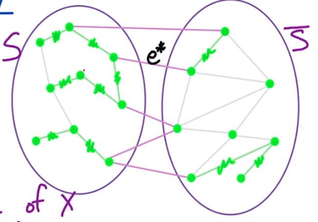

# 7. MST

## 7.0. 问题描述

什么时候Greedy Algorithm的局部最优解能导致最优解？

我们发现：
1. 在Knapsack问题中，局部最优不能导致全局最优
2. MST问题中，我们会讲到 cut property以及相关的一些 引理。（这是重点）

在常见的MST问题中：
- input: 无向有权图 $G=(V,E)$，权重为$w(e) \text{ for } e\in E$
- output: 找到最小连通子图 minimal size, connected subgraph （也就是MST）

Some Basic Tree Properties:
1. 有$n$个节点的 Tree 一定有 $n-1$条边
2. 在Tree中，任意两个节点之间都有且仅有一个path
3. 任何Connected Graph $G=(V, E)$只要满足$|E| = |V|-1$，那么它就是一个Tree。

## 7.1. Kruskal's Algorithm
核心思想就是Greedy Algorithm—— 每次都选权重最小的边，只要不形成 cycle就继续，直到所有边都被遍历完为止。伪码如下：
```
Kruskal's(G):
    input: undirected G=(V, E) with weights w(e)
    1. sort E by weights w(e) ascendingly
    2. let X = {} empty set
    3. For each edge e = (v, w) in E by weight's order:
        if X ∪ {e} does NOT have a cycle:
            X = X ∪ {e}
    4. Return X
```
时间：$m\log n \text{, where } m = |E|, n=|V|$

有这么几点要说明：
1. 如何判断有没有成环？——对于当前边$e=(v,w)\in E$来说，如果$c(v) = c(w)$的话，那么加上当前边$e$就会成环。其中$c(v), c(w)$分别表示节点$v, w$所在的Component。🤔那怎么确定两个Components呢？—— 用Union-Find这个数据结构。通过Union-Find我们能在$O(\log n)$时间内找到$v, w$所在的Component，并判断两个Component是否相同。如果不同，我们也能在$O(\log n)$时间内将这两个Component 合并成一个大的Component。这就解释了为什么最后的时间复杂度是$O(m\log n)$

🤔接下来我们要看一下How does union-find work?

<details>
<summary>How does union-find work?</summary>

</details>

## 7.2. Kruskal's Algorithm's Correctness and Cut Property

引理：

对于一个undirected graph $G=(V, E)$，取$X\subset E \text{, where }  X \subset T$，$T$是一个MST；然后取$S\subset V$其中的边$X$都不在$\text{cut}(S, \bar{S})$上；然后看图$G$中所有位于$\text{cut}(S,\bar{S})$的边。我们用$e^*$表示$\text{cut}(S,\bar{S})$上权重最小的边。然后我们有结论：$X\cup e^*\subset T' \text{, where } T'$是MST。


上面的引理说得直白一点就是，我们首先假设边$X$已经在MST上了（用图中绿色表示的边）。然后取一组节点$S\subset V$使得任何已经在MST上的边$X$都不在切分$\text{cut}(S,\bar{S})$处，切分处用图中粉色边表示。（⚠️注意当选好节点集合$S$后，$\bar{S}$也自然形成了，同时$\text{cut}(S,\bar{S})$也随之形成了）然后，我们就从粉色切分处$\text{cut}(S,\bar{S})$ 找到权重最小的边$e^*$加入到集合$X$里作为MST的新边即可。


