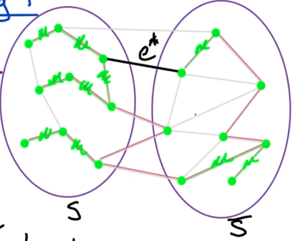

# 7. MST

## 7.0. 问题描述

什么时候Greedy Algorithm的局部最优解能导致最优解？

我们发现：
1. 在Knapsack问题中，局部最优不能导致全局最优
2. MST问题中，我们会讲到 cut property以及相关的一些 引理。（这是重点）

在常见的MST问题中：
- input: 无向有权图 $G=(V,E)$，权重为$w(e) \text{ for } e\in E$
- output: 找到最小连通子图 minimal size, connected subgraph （也就是MST）

Some Basic Tree Properties:
1. 有$n$个节点的 Tree 一定有 $n-1$条边
2. 在Tree中，任意两个节点之间都有且仅有一个path
3. 任何Connected Graph $G=(V, E)$只要满足$|E| = |V|-1$，那么它就是一个Tree。

## 7.1. Kruskal's Algorithm
核心思想就是Greedy Algorithm—— 每次都选权重最小的边，只要不形成 cycle就继续，直到所有边都被遍历完为止。伪码如下：
```
Kruskal's(G):
    input: undirected G=(V, E) with weights w(e)
    1. sort E by weights w(e) ascendingly
    2. let X = {} empty set
    3. For each edge e = (v, w) in E by weight's order:
        if X ∪ {e} does NOT have a cycle:
            X = X ∪ {e}
    4. Return X
```
时间：$m\log n \text{, where } m = |E|, n=|V|$

有这么几点要说明：
1. 如何判断有没有成环？——对于当前边$e=(v,w)\in E$来说，如果$c(v) = c(w)$的话，那么加上当前边$e$就会成环。其中$c(v), c(w)$分别表示节点$v, w$所在的Component。🤔那怎么确定两个Components呢？—— 用Union-Find这个数据结构。通过Union-Find我们能在$O(\log n)$时间内找到$v, w$所在的Component，并判断两个Component是否相同。如果不同，我们也能在$O(\log n)$时间内将这两个Component 合并成一个大的Component。这就解释了为什么最后的时间复杂度是$O(m\log n)$

🤔接下来我们要看一下How does union-find work?

<details>
<summary>How does union-find work?</summary>

</details>

## 7.2. Kruskal's Algorithm's Correctness and Cut Property

证明：

核心思路还是用induction，即，我们假设当前所有找到的边（绿色）都是MST的边，然后只需要证明接下来要找到的边也将会是MST的边即可。

1. 我们用$X\subset E$表示目前为止已经属于MST的边（绿色）。
2. 然后我们取一个集合$S\subset V$使得没有绿色的边$X$会被$\text{cut}(S,\bar{S})$切到。
3. 被切到的边我们用粉色表示。遍历所有粉色的边，找到其中权重最小的边$e^*$

根据induction，我们就需要证明这个当前权重最小的粉色边 加上之前已经找到的$X$集合都在最终的MST中，即：$e^*\cup X\subset T'$。


<span style="color:cyan">引理：</span>

对于一个undirected graph $G=(V, E)$，取$X\subset E \text{, where }  X \subset T$，$T$是一个MST；然后取$S\subset V$其中的边$X$都不在$\text{cut}(S, \bar{S})$上；然后看图$G$中所有位于$\text{cut}(S,\bar{S})$的边。我们用$e^*$表示$\text{cut}(S,\bar{S})$上权重最小的边。然后我们有结论：$X\cup e^*\subset T' \text{, where } T'$是MST。


上面的引理说得直白一点就是，我们首先假设边$X$已经在MST上了（用图中绿色表示的边）。然后取一组节点$S\subset V$使得任何已经在MST上的边$X$都不在切分$\text{cut}(S,\bar{S})$处，切分处用图中粉色边表示。（⚠️注意当选好节点集合$S$后，$\bar{S}$也自然形成了，同时$\text{cut}(S,\bar{S})$也随之形成了）然后，我们就从粉色切分处$\text{cut}(S,\bar{S})$ 找到权重最小的边$e^*$加入到集合$X$里作为MST的新边即可。


## 7.3. Kruskal's Algorithm's Proof

首先我们有$G, X, T, S, e^*$，分别表示原来的无向有权图、目前为止已经被加入到最终解的边、某个最终可行的MST、$S$表示一部分边集合$X$的子集，使得$\text{cut}(S, \bar{S})$不切割到任何$X$集合中的边、$e^*$表示被切到的边中权重最低的边。

证明：如何证明$e^*$就是正确的边呢？如果能证明这点，就意味着induction成立，即算法成立。

1. 如果$e^*$就在最终MST $T$中。这当然好，因为$X\cup e^* \subset T'$，且$T'=T$。正是我们要证明的
2. 如果$e^*$不在最终MST $T$中。例如下图，红色边表示$T$，绿色边表示目前为止的$X$边的集合。这种情况下要将$e^*$加入$T$会形成一个cycle。如下图蓝色边所示。所以需要去掉一个边来打破当前的cycle。又因为已经被找到的边的集合$X$的权重一定小于所有$\text{cut}(S, \bar{S})$边的权重；且$e^*$又是当前四个$\text{cut}(S, \bar{S})$边里权重最小的，所以我们要去掉剩下三个边中的任意一条（用$e'$表示）


<!-- <p></p> -->

<p></p>

所以上面两种情况总结起来用集合表示就是：$T'=T\cup e^*-e'$。

最终我们需要证明：$T'$是树。这里我们回想一下tree的性质：
对于一个图来说，如果它是connected的，且只有 $n-1$条边，那么它就是一个树。

我们有$T'=T\cup e^*-e'$，意味着$T'$正好有$n-1$条边(因为$T$已经是树了，再加上并减去一条边还是n-1条)。

接下来就是证明$T'$是 connected的。我们分别从$S,\bar{S}$中取两个节点$y,z$，如下图。
<p></p>

根据$T'=T\cup e^*-e'$，我们去掉了$e'$边，然后引入了$e^*$边。这导致原本从$y\rarr e' \rarr z$的边不存在了。我们暂时用$P$表示这条边$P=y\rarr e' \rarr z$。

又因为我们添加了一条$e^*$边，并形成了一个cycle $c$

<p></p>


