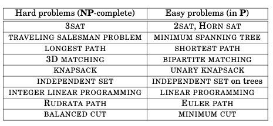
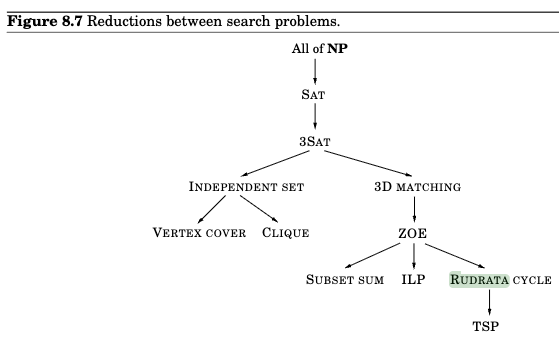
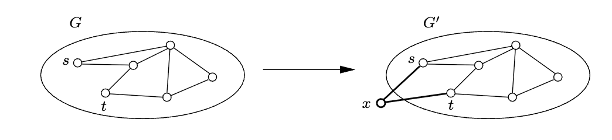
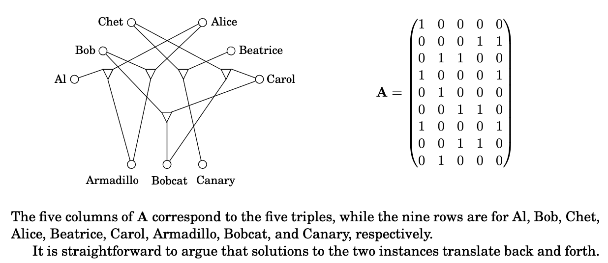
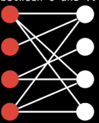
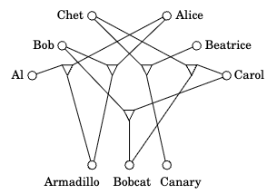

## 0. Problems Table

## 1. SAT

## 2. 3SAT

## 3. Independent Set (IS)
什么是Independent Set? —— 

有一个undirected grpah G = (V, E)，如果一个节点子集 $S\subset V $中的任意两个节点都不构成一条边，那么$S$就是 Independent Set (IS)。即，$\text{for all } x, y \in S, (x, y)\not\in E$。

**Quiz 1.**

Input: undirected graph G=(V,E); Output: independent set S of maximize size.

Question is: "The Max Independent Set problem is known to be NP." Is this claim true or false? —— False

因为无法在多项式时间内验证一个给定的答案是否为 最大IS。因为如果想要验证，意味着我们需要一个能在多项式时间内找到 Max IS的算法，这就意味着 P=NP。如果 P != NP，则 Max IS问题就不是NP问题

## 4. Vertex Cover (VC)

## 5. Subset Sum (SSS)

## 6. Rudrata Path
对于一个无向图 G = (V, E)，要找到一个 path 使得它所有的节点刚好能够遍历图G中所有 节点恰好一次

## 7. Rudrata (s, t)-Path

Rudrata (s,t)-Path 问题说的是，给了一个无向图 G=(V, E)，以及两个图中的节点$s, t$，要找到一个path，使得path 的起止节点分别为$s, t$，且该path恰好经过每个节点一次。

Rudrata cycle问题的难度 高于  Rudrata (s, t)-Path问题。这里是证明：

即，我们要找到从Rudrata (s, t)-Path $\rarr$ Rudrata cycle的归约。该归约以 $(G=(V,E), s, t)$为input，并将该input转换为$G'=(V', E')$作为Rudrata cycle问题的input。我们可以这样做变换：在原图$G=(V, E), s, t$中，我们在$s, t$之间加一个中间节点$x$和两条边$(s,x), (x,t)$，例如下图：

于是你会发现若存在对于Rudrata (s, t)-Path的解，那么Rudrata cycle的解也一定存在（就是多了新加的这两条边）。若Rudrata (s, t)-Path无解，则Rudrata cycle也无解。所以我们完成了归约并证明了IFF。

textbook

## 8. Rudrata Cycle
对于一个无向图 G = (V, E)，要找到一个 cycle 使得它所有的节点刚好能够遍历图G中所有 节点恰好一次

## 9. Integer Linear Programming (ILP)

## 10. Zero-One Equations (ZOE)

说给了一个$m\times n$的矩阵$\textbf{A}$，它的每个元素只能是0或1，我们要找到一个向量$\textbf{x}$使得$m$个等式$\textbf{Ax}=1$成立。且向量$\textbf{x}=(x_1,\dots, x_n)$的每个元素也都只能是0或1.

从3D-matching $\rarr$ ZOE

## 11. 3D Matching

二分图 (Bipartite Graph) - 图G中所有节点能够被分成两个 集合 $V_1$, $V_2$。每个集合中的节点之间互不相连。图中所有边的两个节点都满足：一个来自$V_1$，另一个来自$V_2$

知道了 Bipartite (Bigraph)，我们看 3D Matching。该问题希望在 已知一个有$n$个节点的 bipartite graph后，找到一个不相连的$n$条边的集合。

例如我们有$n$个男孩和$n$个女孩的集合（作为节点），然后还有$n$个宠物。他们之间的适配性我们用三元元组(triple)表示，写成：$(b,g,p)$分别表示男生、女生、宠物。我们想找到$n$个 disjoin triples（不相交的三元元组）来创建$n$个 “和谐家庭”。如下图，如何能找到合适的 分配方案？

- Boys: Al, Bob, Chet
- Girls: Alice, Beatrice, Carol
- Pets: Armadillo, Bobcat, Canary

3D matching问题通常会给一个图 G=(V,E)，里面的三角形节点表示：被它连接的三个物种（男、女、宠物）之间能共处。我们想要找到从 3SAT $\rarr$ 3D matching的归约

## 12. TSP

