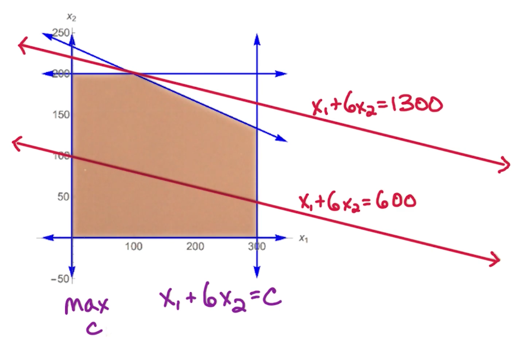
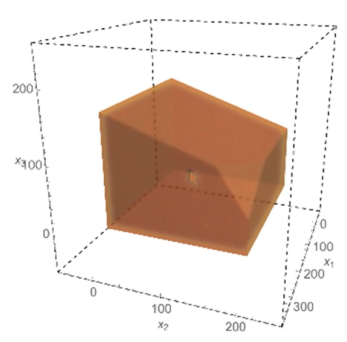
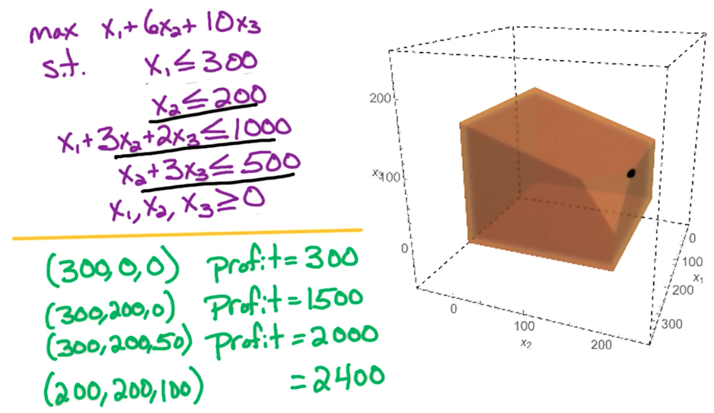

# 14. Linear Programming

## 14.0. Basic Production Problem

一个公司有两个产品， A， B。每个产品的纯利润分别是 一美元和六美元。市场需求来说，A每天需要不超过300个，B不超过200个。公司的总工时每天不超过700小时。每生产一个A 需要1小时，生产一个B需要3小时。如何最大化公司利润？

$$
\begin{aligned}
\text{Maximize } & z = x_1+6x_2 \\
\text{s.t. } &
\begin{cases}
0\leq x_1 \leq 300; \\ 
0\leq x_2\leq 200; \\
x_1+3x_2\leq 700
\end{cases}
\end{aligned}
$$

下图是集合的方法求解

得到的最优结果是$(x_1=100, x_2=200)$。但有一个问题是，产品只能是正整数，但我们有可能遇到最优解不是整数的情况。诸如此类问题，问题本身限定了最优解只能是正整数，这类问题就是 ILP （整数线性规划）Integer Linear Programming。这类问题是NP-Complete的，之后我们会给出证明。

* 线性规划问题（LP）$\in$ P类问题
* ILP 是NP-Complete问题
* Vertex = Corner
* 可行域(feasible region)是凸的(convex)

## 14.1. 3D Production Problem

还是上面类似的问题，我们改成较为复杂的3d，也就是引入额外的一个约束变量：

* 一家公司有三种产品A, B, C。每种产品的纯利润分别为 1, 6, 10 美元。
* 市场需求：A每天不超过300个，B不超过200个
* 供应链：公司每天最多有1000个工时。生产A需要1个工时，B需要3个工时，C需要2个工时
* 包装：公司每天最多能花费500工时在包装上，A不需要包装；B需要1个工时来包装；C需要3个工时

$$
\begin{aligned}
\text{Maximize } & z = x_1+6x_2+10x_3 \\
\text{s.t. } &
\begin{cases}
0\leq x_1\leq 300 \\
0 \leq x_2 \leq 200 \\
x1+3x_2+2x_3 \leq 1000 \\
x2+3x_3 \leq 500 \\
0 \leq x_3
\end{cases}
\end{aligned}
$$

3D图如下

## 14.2. 标准形 (Standard Form) 与线性代数

$$
\begin{aligned}
\text{Maximize } & z = c_1x_1+c_2x_2+\dots+c_nx_n \\
\text{s.t. } &
\begin{cases}
a_{11}x_1+a_{12}x_2+\dots+a_{1n}x_n \leq b_1 \\
a_{21}x_1+a_{22}x_2+\dots+a_{2n}x_n \leq b_2 \\
\dots \\
a_{m1}x_1+a_{m2}x_2+\dots+a_{mn}x_n \leq b_m \\
x_1, x_2, \dots, x_n \geq 0
\end{cases}
\end{aligned}
$$

如此我们就能用线性代数来解决该问题了：
$$
X = \begin{pmatrix}
x_1 \\
\dots \\
x_n
\end{pmatrix}

C = \begin{pmatrix}
c_1 \\
\dots \\
c_n
\end{pmatrix}

A = \begin{pmatrix}
a_{11} & a_{12} &\dots & a_{1n} \\
a_{21} & a_{22} &\dots & a_{2n} \\
\dots \\
a_{m1} & a_{m2} &\dots & a_{mn} \\
\end{pmatrix}

B = \begin{pmatrix}
b_1 \\
\dots \\
b_n
\end{pmatrix}
$$

我们分别用$X, C, A, B$表示变量、目标函数的系数、约束矩阵系数、约束值

那么我们就可以将原来的线性规划问题写成：
$$
\begin{aligned}
\text{Maximize } & z = C^TX \\
\text{s.t. } &
\begin{cases}
AX\leq B \\
X\geq \textbf{0}
\end{cases}
\end{aligned}
$$

技巧：
1. 遇到 $\text{Minimize}$问题，需要乘-1 变成$\text{Maximize}$问题
2. 遇到 $\geq$也要乘-1 变成 $\leq$问题
3. 遇到 $=$ 问题，需要将当前复制成两份；一份的 $=$变成$\leq$ ；另一份 $=$ 变成 $\geq$。变成 $\geq$ 的那一份要再进行上面 第2个技巧 的变换

## 14.3. 单纯形算法(Simplex Algorithm)

1. 先从某个可行解开始，通常选 x=0，然后进行 local search
2. 每次search要找 临近节点中 能让 objective function 变大的 节点 （意味着，每次最多要搜索O(nm)个相邻节点），若能找到这样的节点，就移动到该节点
3. 重复第二步直到找不到比自己大的 相邻节点为止。

> NOTE1: 第二步中，如果有多个节点 都比当前节点的 objective function的值大，那随便选哪一个都可以

> NOTE2: 第二步中的 n, m 分别表示 变量的个数和 约束的个数

案例：

该案例中，Simplex算法从第一个可行解$(x_1, x_2, x_3)=(300,0,0)$开始，逐渐找到$(x_1, x_2, x_3)=(200,200,100)$为最后的最优解。

