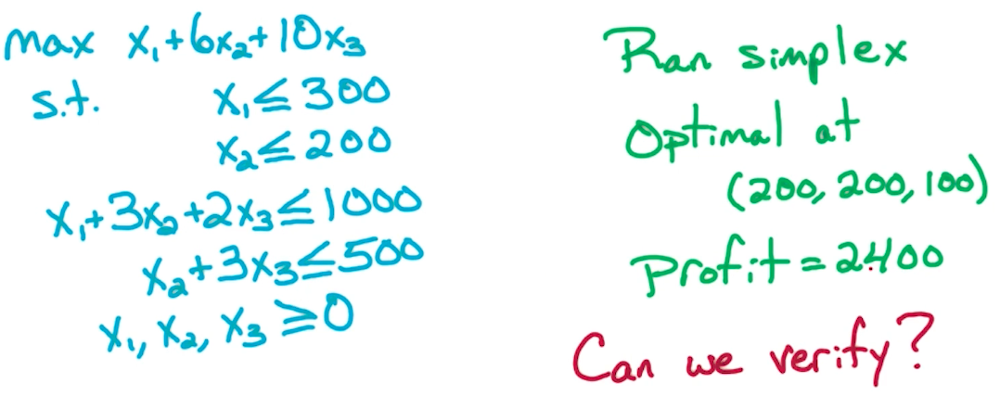
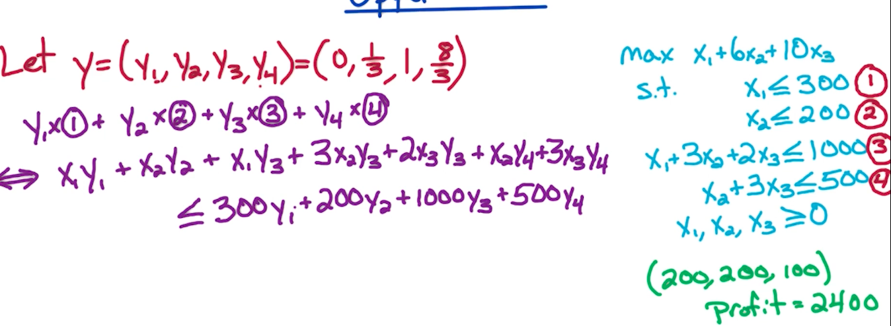
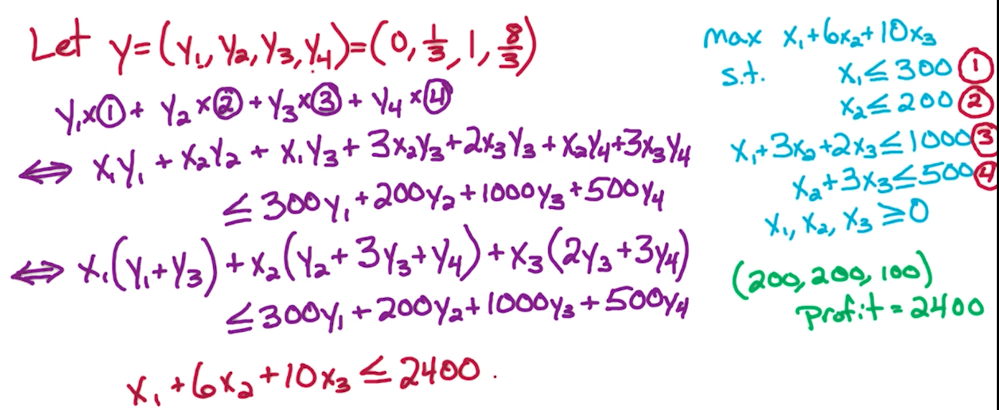
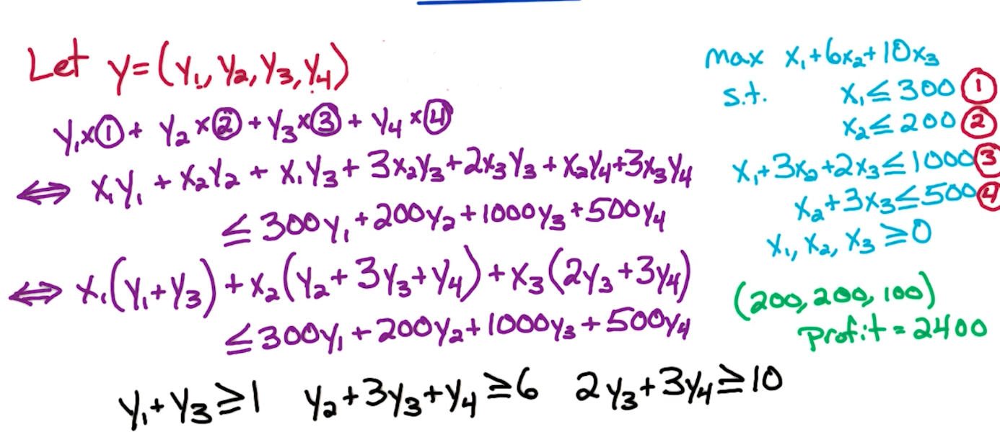
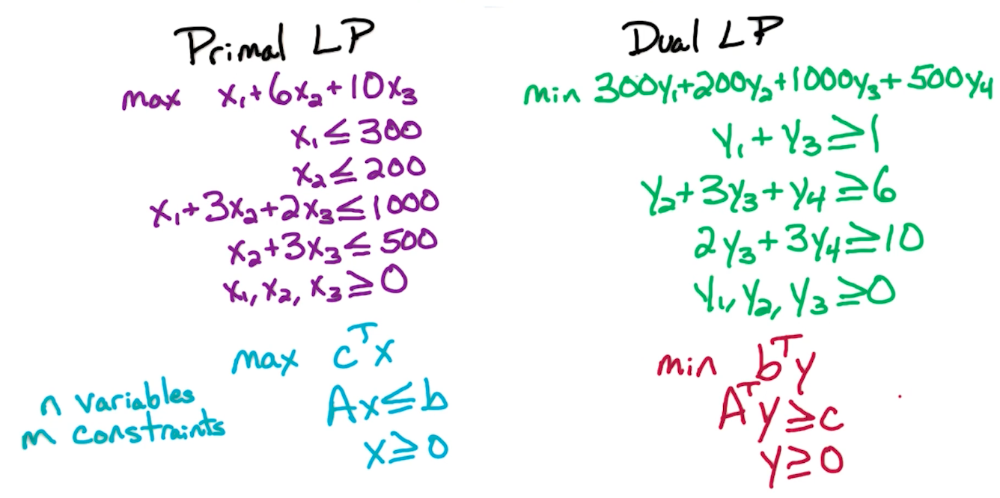

# 16. LP Duality

## 16.1. 

假设有这么个线性规划问题，然后有人说2400 就是该问题的最优解。那我们如何验证他说的对不对呢？

思路就是，既然2400是最大值，意味着至少有一个限制条件达到了边界，那我们就挨个尝试每个限制条件即可。

如下图，我们让 $y=(y_1, y_2,y_3,y_4)=(0,\frac{1}{3},1,\frac{8}{3})$（先不管 y 是怎么来的）。然后我们用 $y$分别乘每个限制条件，得到图中的紫色式子

我们化简一下有下面图中的式子，然后代入$y$的值，发现$x_1+6x_2+10x_3\leq 2400$。该不等式左边恰好是objective function；右边恰好是2400。这就证明2400 就是该线性规划的最优解。

---

这个$y$是什么？怎么找到的？

我们先从 $y=(y_1, y_2, y_3, y_4)$开始，然后化简得到了: 

$x_1(y_1+y_3)+x_2(y_2+3y_3+y_4)+x_3(2y_3+3y_4)\leq (300y_1+200y_2+1000y_3+500y_4)$ （不等式1）

取每个term的系数，于是有$y_1+y_3\geq 1; y_2+3y_3+y_4 \geq 6; 2y_3+3y_4\geq 10$。这里的1，6，10来自于objective function

到此，我们要找到 不等式1 左边的最大值，而该最大值一定是 不等式1 右边部分的最小值。因此，找 $\max x_1+6x_2+10x_3$ 就等同于 找 $\min 300y_1+200y_2+1000y_3+500y_4$ 约束条件就是上面 3 个关于 $y$ 的短不等式。 这种性质就是LP Duality

我们将变换前后的LP问题写出来如下：

右边的就是左边 Dual LP。左边的叫Primal LP

定理：某个 canonical form（标准型）的LP 问题进行两次 Dual 之后是它自己

## 16.2. Weak Duality

Primal LP 的可行解 $x$; Dual LP的可行解$y$。我们知道 Dual LP的目标函数$b^Ty$是 Primal LP的目标函数$c^Tx$的上界，于是有：$c^Tx\leq b^Ty$

推论1 - 因此，对于一个LP问题，我们需要同时找到 Primal LP的最大 与 Dual LP的最小，即使得$c^Tx = b^Ty$。

那什么时候该等式无法满足呢？—— 不满足的情况是，它们二者之一是infeasible or unbounded

推论2 - 如果一个 Primal LP 是unbounded， 那么它的Dual LP一定是 infeasible。如果一个Dual LP是unbounded，那么它的Primal LP一定是infeasible的

## 16.3. Check unbounded

所以对于一个LP问题，我们想看它是 bounded/unbounded 和 feasible/infeasible，我们可以检测Primal LP和Dual LP是否为bounded，若都是，则Dual LP为bounded意味着 Primal LP是feasible的。

## 16.4. Weak Duality Part 2

## 16.5. Strong Duality

当且仅当 Primal LP 是 feasible and bounded 则 Dual LP 也是feasible and bounded

当且仅当 Primal has optimal $x^*$ 时，Dual LP has optimal $y^*$。此时，$c^Tx^*=b^Ty^*$

这里就能与 max-flow min st-cut theorem联系起来了

