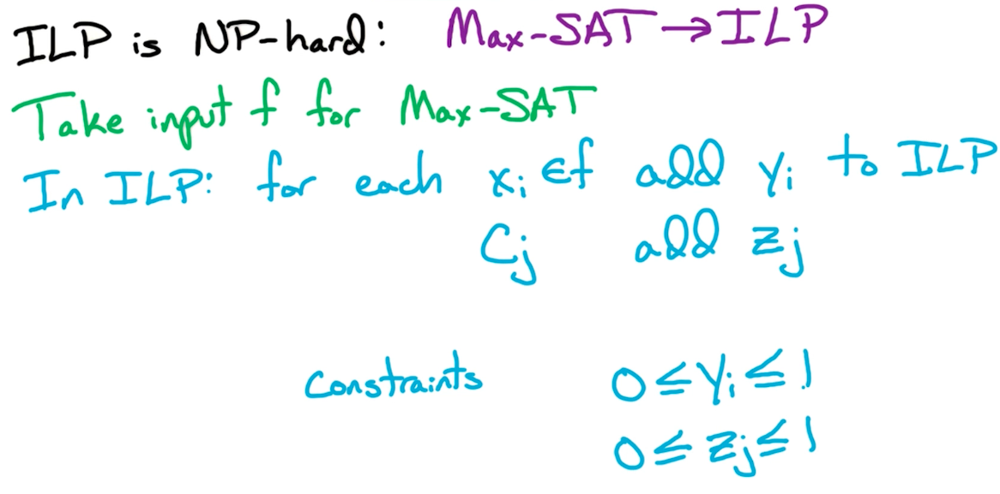

# 17. Max-SAT

## 17.1. 问题描述

input: Boolean formula $f$ in CNF with $n$ variables and $m$ clauses

output: an assignment that satisfies as many number of clauses as possible

也就是尽可能多地去满足 clauses

我们已知SAT问题是 NP-complete问题。这里的Max-SAT问题是 NP-Hard 问题。我们将通过LP 来逼近Max-SAT的解

## 17.2. Approximate Max-SAT问题

对于 一个有$m$个 clauses的CNF formula $f$，我们让$m^*$表示最多可能满足的clauses的个数。很明显，$m^*\leq m$。现在我们要找到一个算法 $A$，以$f$为输入。该算法输出$l$，也就是估算的能满足clauses的最大个数。

如果$l\geq \frac{m^*}{2}$，那么这就是个$\frac{1}{2}$-Approx 算法。

1. Simple Algorithm: $\frac{1}{2}$-Approx 算法 for Max-SAT问题
2. LP-based: $1-\frac{1}{e}$-Approx 算法
3. Best of 2: $\frac{3}{4}$-Approx 算法

### 17.2.1. Simple Scheme

简单的方法就是我们随机给$x_i$赋值True 或 False，概率分别为50%，50%。然后我们定义$w$表示能够被满足的clauses的数量。那么$w$的期望值表示成：$\mathop{\mathbb{E}}[w]=\sum_{l=0}^m l \mathbb{P}(w=l)$。如果这么算期望，你会发现很难，因为某个clause是否被满足 还取决于其他literal的值。

我们可以按照下面这种方法来算期望：$w$还表示能被满足的clauses的个数，对于每个clause $c_j$：
- 如果$c_j$被满足，则让$w_j=1$
- 如果$c_j$不能被满足，则让$w_j=0$

于是有$w=\sum_{j=1}^m w_j$

于是，我们可以有：$\mathop{\mathbb{E}}[w]=\mathop{\mathbb{E}}[\sum_{j=1}^m w_j]=\sum_{j=1}^m \mathop{\mathbb{E}}[w_j]$

你会发现该期望只取决于 $c_j$

对于每个$c_j$，若能满足$c_j$，则$w_j=1$；若不能，则$w_j=0$。于是$\mathbb{E}[w_j]=1\times \mathbb{Pr}(w_j=1)+0\times \mathbb{Pr}(w_j=0)=\mathbb{Pr}(w_j=1)$

举例来说，如果$c_j=(x_1\lor \bar{x_2}\lor \bar{x_3}\lor x_4\lor \dots\lor x_k)$那么能让$c_j$满足的概率为$1-$不能让其满足的概率，就是$1-2^{-k}$

### 17.2.2. Ek-SAT

根据上面说的概率，不难看出，当$k=3$时，我们有 E3-SAT 问题，此时，$c_j$被满足的概率应该是：$\mathbb{Pr}(c_j=1)=\frac{7}{8}$。这个是$\frac{7}{8}$-Approx for max-E3-SAT。

对于 Ek-SAT来说，$c_j$被满足的概率应该是：$\mathbb{Pr}(c_j=1)=1-2^{-k}$。此时就是$(1-2^{-k})$-Approx for max-Ek-SAT。

经研究发现$\frac{7}{8}$-Approx 对于NP-Hard问题来说 已经是最佳的。若所有的clauses的大小都是 3，此时我们仅用简单的5/5概率就能得到 能得到的最好的 逼近（估计）。

## 17.3. Integer Programming (ILP)

第二种方法是用 整数规划 来逼近（求近似解）

整数规划形式如下：
$$
\begin{aligned}
\text{Maximize } & c^Tx \\
\text{s.t. } &
\begin{cases}
Ax\leq b \\
x \geq 0 \\
x\in \mathbb{Z}^n
\end{cases}
\end{aligned}
$$
每个$x_i$都是整数

LP 问题属于 P问题
ILP问题是NP-hard

我们可以通过Max-SAT 问题来看一下为什么ILP是NP-Hard。我们要从 Max-SAT $\rarr$ ILP

- Max-SAT有 $n$个literals $x_i$。每有一个$x_i$，我们就添加一个$y_i$到ILP问题中；表示若$x_i=T$，则$y_i=1$；否则$y_i=0$
- Max-SAT有 $m$个Clauses $c_j$。每有一个$c_j$，我们就添加一个$z_j$到ILP问题中；表示若$c_j=T$，则$z_i=1$；否则$z_i=0$
- 额外的约束条件是 $0\leq y_i\leq 1; 0\leq z_j\leq 1$。又因为只能取整数，所以$y_i, z_j$只能是0或1.

例1: 例如我们有 $c=(x_5\lor x_3\lor x_6)$，然后要让$c=False$，意味着里面所有$x_i=0$，于是所有$y_i=0$，于是$z_j=0$。反之，如果$c=True$，意味着$x_i$至少有一个为 1；至少有一个 $y_i=1$；意味着$y_5+y_3+y_6 \geq z_j = 1$。

例2:又例如我们有 $c=(\bar{x_1}\lor x_3 \lor x_2\lor\bar{x_5})$，要让$c=False$，意味着 $y_1=1,y_3=0,y_2=0,y_5=1$，此时 $z_j=0$，于是有$(1-y_1)+y_3+y_2+(1-y_5)\geq z_j=0$。

之后我们将用$c_j^+$表示结果为True的clause；$c_j^-$表示结果为false的clause

### 17.3.1 Max-SAT $\rarr$ ILP 归约
对于一个 CNF $f$，我们可以通过下面的方式归约成 整数规划问题 ILP：

$$
\begin{aligned}
\text{Maximize } & \sum_{j=1}^m z_j \\
\text{s.t. } &
\begin{cases}
\text{for all } i=1,\dots, n: & 0\leq y_i \leq 1 \\
\text{for all } j=1,\dots, n: & 0\leq z_j \leq 1 \\
\sum_{i\in c_j^+} y_i + \sum_{i\in c_j^-}(1-y_i) \geq z_j \\
\text{all } y_i, z_j \text{ are integers} \\
\end{cases}
\end{aligned}
$$

我们用$y^*, z^*$ 表示上面 ILP问题的最优解。那么对于目标函数来说它的最大值就是：

$m^*=z^*_1+z^*_2+\dots + z^*_m$，也就是最多能够被满足的clauses的个数。

我们知道ILP无法在多项式时间内求解（因为是NP-Hard），但LP问题因为属于P问题，所以LP能在多项式时间内求解。能不能将 ILP 转换成 LP问题？—— 可以，我们只要简单地去掉 $\text{all } y_i, z_j \text{ are integers}$   这个约束条件即可。

然我们用$\hat{y^*}, \hat{z^*}$分别表示 LP 问题的最优解。那$\hat{y^*}, \hat{z^*}$ 与 ILP最优解。$y^*, z^*$ 之间有什么关系？—— 小于等于的关系。

我们能看出，当某个$z_j^*=1$时，对应的$\hat{z_j^*}=1$。但$z_j^*=0$时，对应的$\hat{z_j^*}\geq 0$。因此我们有：

$m^*=z^*_1+z^*_2+\dots + z^*_m \leq \hat{z_1^*} + \hat{z_2^*} + \dots + \hat{z_m^*}$

但光有这个关系还不够，我们还是无法解决（或者逼近） ILP 问题的最优解。所以，我们可以round一下。然后我们只要能证明 round之后的结果与 ILP问题实际最优解之间没有差太多即可成功逼近 ILP问题的最优解。

Rounding:

我们用$\hat{y^*}, \hat{z^*}$分别表示 LP 问题的最优解。现在我们想让整数$y_i,z_j$尽可能接近$y_i^*,z_j^*$。其中$0 \leq y_i^*\leq 1$。我们简单地用 Randomized Rounding的方法进行如下Round：

$$
y_i = 
\begin{cases}
1 \text{ with probability of } \hat{y_i^*} \\
0 \text{ with probability of } 1-\hat{y_i^*} \\
\end{cases}
$$

我们用$w$表示能被满足的clauses的个数, $w_j=1$表示 $c_j$能被满足；$w_j=0$表示不能被满足。

此时我们有$w=\sum_{j=1}^m w_j$，且：

$$
\mathbb{E}[w]=\sum_{j=1}^m\mathbb{E}[w_j]=\sum_{j=1}^m\mathbb{Pr}(c_j(sat)) \\
\geq(1-\frac{1}{e})\sum_{j=1}^m \hat{z_j^*} \\
\geq (1-\frac{1}{e})\sum_{j=1}^m z_j^*=(1-\frac{1}{e})m^*
$$

这里都很好理解，只有$\mathbb{Pr}(c_j(sat)) \geq (1-\frac{1}{e})\hat{z_j^*}$需要通过之后的引理来证明。

引理证明：

$c_j=(x_1\lor x_2\lor \dots \lor x_k)$

