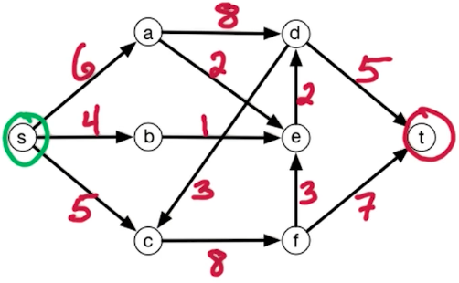
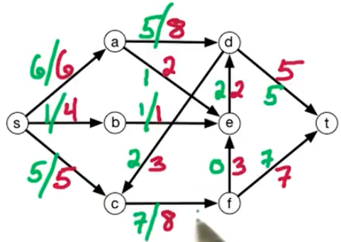
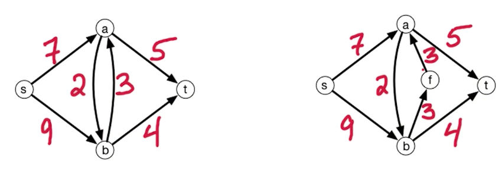
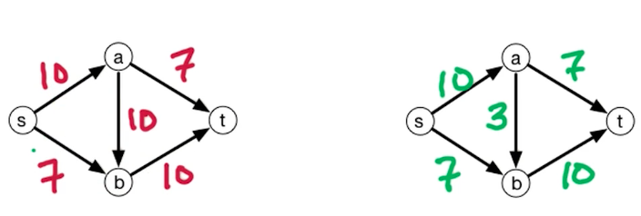
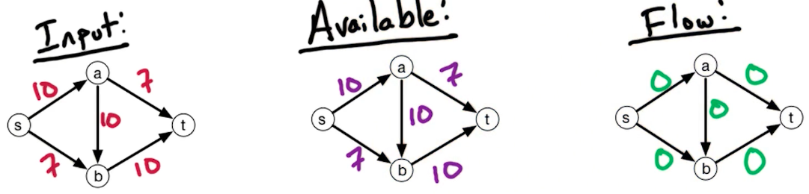
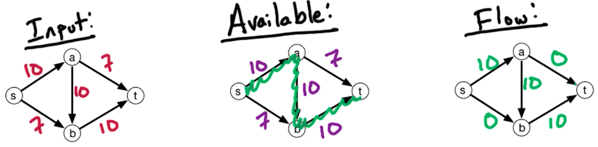
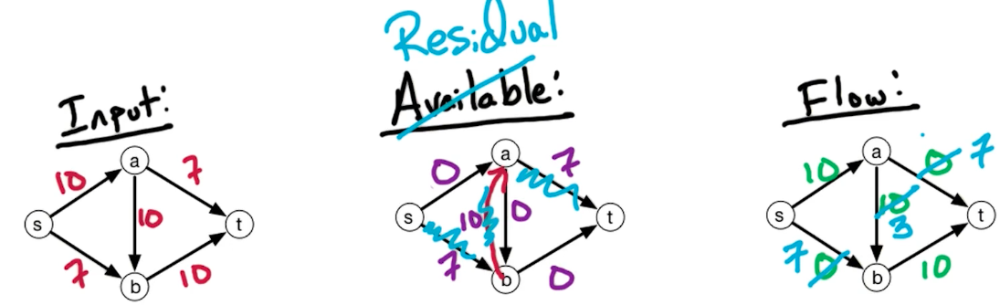

# 8. Max-Flow Problem

## 8.0. 问题描述

在一个有向有权图中，给定了起点s 终点t，我们打算找到能够 流入终点t 最大的方法，同时又不超过每条边的承载能力

输入：
* Flow network directed $G=(V,E) \text{ with } s, t\in V$且边的容量$c_e>0 \text{ for } e\in E$

输出：
* 找到所有的flows $f_e, e\in E$，使得流入终点t的流量最大

限制条件是：
* 所有的边不超过各自的容量上限：$e\in E, 0\leq f_e \leq c_e$
* 所有节点，流出的流量不超过进入的流量：$v\in V - {s\cup t}, \sum_{\vec{wv}\in E}f_{wv}=\sum_{\vec{vz}\in E}f_{vz}$

## 8.1. Anti-parallel Edges
如下左图所示，a, b之间就存在一个anti-parallel edges。我们可以通过给任意一个边添加一个额外节点来消除anti-parallel，如右图所示：

上面这两个图是等效的。

在看下面的图，左边图不难看出 max-flow = 17

我们用下面图里的available来表示当前还有多少capacity剩余。这里可以用DFS或者BFS来找从 s -> t的一条路径。假设我们找到的是 s -> a -> b -> t 这条路径。每次找到一个边，都用当前边剩余的capacity 减去当前的flow大小，即$c(P) = \min_{e\in P}(c_e-f_e)$。

每次找到了这么一条路径$P$之后，我们就算是有了一个augmenting path，计入到最右边的Flow图里。

这个思路的问题就是，当计入了10个流量之后，就无法找到更大的流量了，因为ab 边用完了容量。继续看的话，我们发现剩下的是 s -> b 的7个流量。如果这时候有一个边是从 b -> a 且有7个容量就好了，这样就能达到最大流量 17。

我们用假想的这 b -> a 的7个流量 对冲掉 原本 a -> b 的10个流量，剩下 a -> b 的 3 个流量如下图所示：

我们发现，这样分流恰好是能达到max-flow的分流方式。

## 8.2. Residual Network
我们来定义上面发现的Residual Network $G^f=(V,E^f)$。

对于 flow network $G=(V,E) \text{ with } c_e \text{ and } f_e, \text{ where } e\in E$。

1. 如果$\vec{vw}\in E \text{ and } f_{vw} < c_{vw}$, 那么就将$\vec{vw}$添加到$G^f$中，并让$\vec{vw}$的容量为$c_{vw}-f_{vw}$。
> 理解一下就是：如果有那么一条边，他的容量比流量大，那就把它加入反图里，并让反图中这条边的容量为 “容量 - 流量”

2. 如果$\vec{vw}\in E \text{ and } f_{vw} > c_{vw}$, 那么就将$\vec{vw}$添加到$G^f$中，并让$\vec{vw}$的容量为$f_{vw}$。
> 反之，如果流量更大，就把它加入到反图，然后让反图中这条边的容量为它的 流量。

## 8.3. Ford-Fulkerson Algorithm

有了上面反图的知识，我们有算法逻辑如下：
1. Set $f_e=0 \text{ for all } e\in E$
2. Build the residual network （反图）$G^f$
3. 找到所有$G^f$中的st-path $P$。（如果没有这样的path，就output $f$）
4. 有了$P$之后，我们让$c(P)$为$G^f$中$P$的最小容量
5. 将 $P$路径上的 $f$ augment $c(P)$ 
6. 重复2-5步，直到没有st-path 为止。

证明会在之后max-flow = min-cut theorem中给出。现在我们看一下时间复杂度，这里我们假设所有边的容量都是integers。
那么由于每次运行，flow都会至少增加 1 个单位，这意味着，该算法一定能在O(C)的次数内运行完，其中C 表示max-flow。

那么每次的时间是多少？—— step 2-5 中，我们需要$O(n)$的时间更新反图的每条边；然后我们还要跑BFS或者DFS找到路径$P$，这需要$O(n+m)=O(m)$时间（因为$n < m）$；最后还需要augment每条边，这也需要$O(n)$时间。所以每次的时间是$O(m)$
所以，时间复杂度就是$O(Cm)$，其中$n, m$表示节点个数和边的个数

