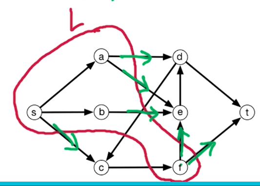
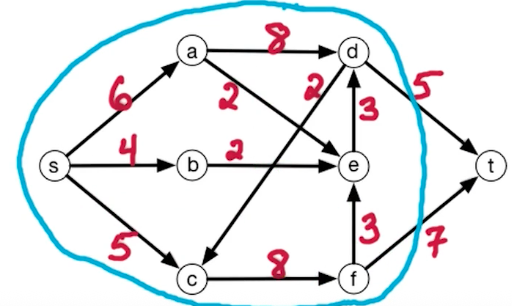
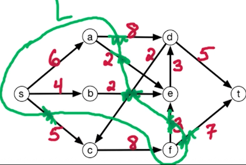
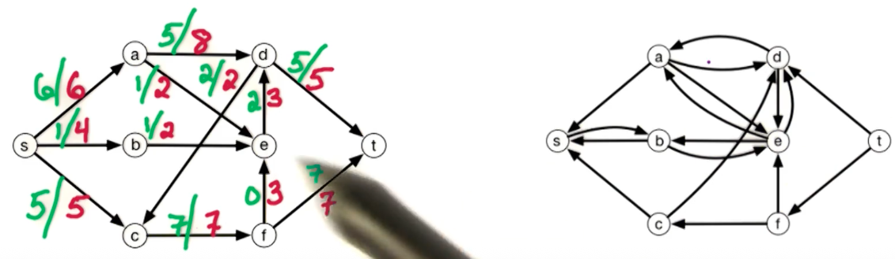
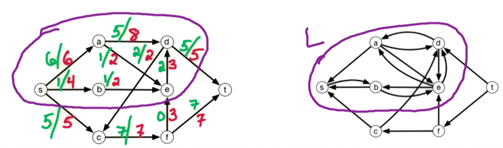

# 9. Max-Flow Min-Cut

引理：对于flow $f^*$来说，如果$G^{f^*}$中不存在 augmenting path，那么$f^*$就是max-flow。

> 反之，如果还存在augmenting path，那么我们还能继续提高flow 到max-flow

## 9.0. Min-Cut Problem

st-cut 是将s 和 t 节点切分开的一种切割方式，我们让$s\in t\in R$。

我们定义从L -> R的容量为：$\text{capacity}(L, R)=\sum_{\vec{vw}\in E, v\in L, w\in R}c_{vw}=\text{ capacity from } L\rarr R$。也就是从L 到 R 的边的容量之和。如下图绿色边所示。

那所谓的 Min-Cut Problem 就是：找到一种切分方式，既能切分开 s 和 t 节点，同时又能让 $L\rarr R$的容量最小。该问题的input, output分别是：
* input: Flow network
* output: st-cut $(L, R)$ with minimium capacity

那么min-cut就是

🤔min-cut刚刚好切到了 dt 和 ft 这两个边，这并不是巧合。这正是 Max-flow Min-cut Theorem，即max-flow 的大小 应该正好等于 min-cut 的容量大小

## 9.1. Proof of Max-flow Min-cut Theorem
证明过程：

要证明上面的 Max-flow Min-cut Theorem, 我们就要证明 max-flow <= min st-cut。也就是对于任何 flow $f$ 和任何 st-cut $(L, R)$，$\text{size}(f) \leq \text{ capacity}(L, R)$。也就意味着如果能证明所有flow中的最大流量 小于等于 st-cut的最小值（即min st-cut）即可，即证明： $\max\text{size}(f) \leq \min\text{capacity}(L, R)$是成立的。

我们先看下面的图，从 s 到 t 一共有 6 个可能的边（绿色），这些边的容量之和为27。当前切分方式下的流量大小$\text{size}(f)=f^{out}(L)-f^{in}(L)$，也就是流出 L 的流量之和 减去 流入 L 的流量之和，这里就是 27 - 8 = 19

我们先来证明这个claim：$\text{size}(f)=f^{out}(L)-f^{in}(L)$。有了它就能证明 Max-flow Min-cut Theorem了。

$$
\begin{alignat*}{}

f^{out}(L)-f^{in}(L) \\

=\sum_{\vec{vw}\in E, v\in L, w \in R}f_{vw}-\sum_{\vec{wv}\in E, w\in R, v\in L}f_{wv}+\sum_{\vec{vw}\in E, v\in L, w\in L}-\sum_{\vec{wv}\in E, w\in L, v\in L}f_{wv} \\
= \sum_{v\in L}f^{out}(v) - \sum_{v\in L}f^{in}(v)\\
= \sum_{v\in L-s}(f^{out}(v)-f^{in}(v)) + f^{out}(s) = \text{size}(f)\\
, \text{therfore, }
f^{out}(s) = \text{size}(f)
\end{alignat*}
$$

这一坨式子表示：
* 流出L和总流量 减去 流入L的总流量 等于
* 所有从 L 到 R 的流量之和 减去 从 R 到 L 的流量之和  加上 从 L 到 L 的流量之和  减去 从 L 到 L 的流量之和
* 我们把上面的第 1、3项 合并，就是$\sum_{v\in L}f^{out}(v)$，第2、4项合并就是$\sum_{v\in L}f^{in}(v)$
* 最后将流出 s 节点的流量单独分离出来就有：$\text{size}(f)=\sum_{v\in L-s}(f^{out}(v)-f^{in}(v)) + f^{out}(s)$。还需要注意，$\sum_{v\in L-s}(f^{out}(v)-f^{in}(v))=0$

接下来要证明：$\max_f\text{size}(f)\geq \min_{(L,R)}\text{capacity}(L, R)$。如果能完成该证明，既能得证：$\max_f\text{size}(f)= \min_{(L,R)}\text{capacity}(L, R)$

我们取一个Ford-Fulkerson算法中的 $f^*$ flow，我们知道，$f^*$在反图$G^{f^*}$中没有st augmenting path。我们需要构建一个$(L, R)$，使得其中$\text{size}(f^*) = \text{capacity}(L, R)$。由于$\text{size}(f^*) \leq \max_f\text{size}(f)$，且$\text{capacity}(L, R)\geq \min_{(L,R)}\text{capacity}(L,R)$，所以我们得出：

$\max_f\text{size}(f)\geq \text{size}(f^*) = \text{capacity}(L, R)\geq \min_{(L,R)}\text{capacity}(L,R)$

那么如果我们能证明上面的等式$\text{size}(f^*) = \text{capacity}(L, R)$，就能证明$\max_f\text{size}(f) \geq \min_{(L,R)}\text{capacity}(L,R)$了。

对于我们取的$f^*$，我们知道当前在反图$G^{f^*}$中已经没有 st-path 了。然后我们让$L$表示 从 s 节点开始所有可达的节点。那么 t 节点就一定不在$L$中（因为 没有 st-path 了）。然后我们定义 $R$为剩余的节点，即$R=V-L$。

如此一来我们就构建了一个st-cut $(L,R)$，接下来就是证明该 st-cut的容量 等于 $f^*$

以下图为例，有剩余容量的边就会在反图中有双向边

然后我们定义$L$为反图$G^{f^*}$所有从 s 节点可达的节点集合。如下图所示

那么原图中从 L -> R 的边就是 dc 、 dt 、sc 这三个边。我们注意到这三条边都不存在于反图中，这并不是巧合，因为如果它们存在于反图中，那么就违背了 “st-path 不存在这一前提”。知道了这一点，我们可以说：

For $\vec{vw}\in E, v\in L, w\in R \text{, we have } f_{vw}^*=c_{vw} \text{ and } f^{*out}=\text{capacity}(L, R)$
也就是说，在当前这种切割方式下，原图中所有从 L 到 R的边的流量之和 等于 它们的容量之和$f_{vw}^*=c_{vw}$，也即$f^{*out}=\text{capacity}(L, R)$

然后再看原图中 从 R -> L 的边，（该例子中就只有一条边，即 ef）我们用 $\vec{zy}\in E, z\in R, y\in L$表示这样的边，我们发现这样的边还会原封不动地出现在反图里。于是有$f^*_{zy}=0, f^{*in}(L)=0$，即反图中 R -> L 的流量为0 。于是有：$\text{size}(f^*)=\text{capacity(L, R)}$。所以上面的等式得证，从而Max-flow Min-cut Theorem得证

