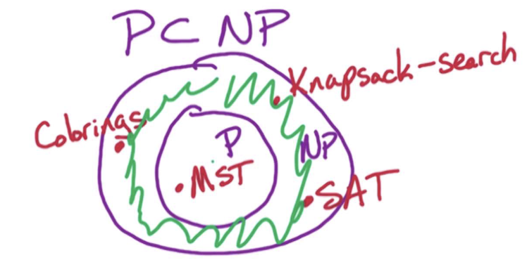

# 11. NP

## 11.0. 

研究该问题就是为了证明：有些问题是无法解决的，或者是“困难的”

* 什么是NP-Completeness?
* P = NP 或者 P ≠ NP 表示什么？
* 如何表示一个问题是 "intractable" 的、无法有效解决的？—— 可以通过 “该问题是NP-Complete的 来证明”

## 11.1. Complexity Classes

什么是 search problem？—— 
* 粗略的定义是: a problem where we can efficiently verify solutions。意味着我们能在 多项式时间内检查问题的解。Class P 问题是能够在多项式时间内找到解的问题。
* NP问题是能够在多项式时间内**验证**解 的问题。这意味着，能否找到解并不重要，重要的是能否**验证解的正确性**。

**总结来说，如果你想知道 找到解所需的时间，那就要看 class P；如果你想知道 能否验证解的正确性，就要看class NP。**

逻辑上来讲，如果我能在多项式时间内求得 解，也就意味着能在多项式时间内验证解的正确性。进而意味着 **P 实际上是 NP的一个子集**。

## 11.2. P 和 NP

* P $\rarr$ 表示所有能够在多项式时间内**求得** 解的问题的集合
* NP $\rarr$ 表示所有能够在多项式时间内**验证** 解的问题的集合

P = NP 和 P ≠ NP分别表示什么？
- P = NP $\rarr$ 表示 **求得解** 和 **验证解** 的复杂度是相同的
- P ≠ NP $\rarr$ 表示 **求得解** 和 **验证解** 的复杂度是不同的

## 11.3. 什么是搜索问题？

搜索问题通常是如下形式出现的：给定一个例子$I$作为问题的输入，如果$I$对于该问题有解，那么就给出所有可行解 中的任意一个解$S$；如果$I$对于该问题无解，则输出"NO"。此外，当有了某一个解之后，我们还需要能够在多项式时间内验证$S$是一个可行解。

> 需要明确的是：所谓的多项式时间 指的是 用输入$I$表示的多项式时间

明确了这些，我们希望设计算法，使得它能 以 $I$和$S$为该算法的input，然后在$I$的多项式时间内验证$S$确实是$I$的解。其中$I$和$S$分别是原问题的输入参数 和 一个原问题的解。

以之前的SAT问题为例，我们有$x_1, \dots, x_n$共$n$个变量，和$m$个括号式，我们希望最后的式子$f$结果为真。

### 11.3.1. 例1 - SAT问题

$f=(x_3\lor\bar{x_2}\lor \bar{x_1})\wedge(x_1)\wedge(x_2 \lor \bar{x_3})\wedge(\bar{x_1}\lor\bar{x_3}) \rarr x_1=T; x_2=F; x_3=F$

为什么SAT属于NP问题？—— 首先，检查一个括号式所需要的时间为$O(n)$；一共有$m$个括号式意味着 求得解的时间为： $O(nm)$。同时这也是验证解所需要的时间。所以它是一个NP问题。

### 11.3.2. 例2 - 配色问题 k-coloring

配色问题说的是，给定 $K$个不同的颜色和一个无向图$G=(V,E)$，要找到一种配色方案使得任意两个相邻的节点颜色都不同。

k-coloring问题也是NP问题 —— 首先假设我们有了一个配色方案，如何 **验证**该方案是否是可行解？我们可以遍历图G，然后检查每个边上的两个节点是否是异色的。遍历所有边的时间为$O(m)$，所以我们是可以在多项式时间内验证 某个解的正确性的，所以是NP问题。

### 11.3.3. 例3 - MST问题

给定一个无向有权图$G=(V,E)$，所有权重$w$都为正数，要找到一个MST $T$。
这也是一个NP问题 —— 首先，给了这样一个图之后，不可能不存在MST。我们只要看给定的这个$T$是不是 最小权重 以及 是不是一棵树即可。要验证$T$是不是一棵树，只需要跑一个dfs/bfs看里面有没有cycle。时间就是O(V+E)。要验证权重是否最小，我们需要跑一个Kruskal/Prim看这两个算法给出的MST权重是否等于 给定的$T$的权重。Kruskal/Prim算法时间是$O(E \log V)$。于是我们证明了MST问题也属于NP问题。

接着要证明MST问题属于P问题就简单了，因为我们知道Kruskal/Prim算法都可以在多项式时间内找到一个可行解。

### 11.3.4. Knapsack问题

给定$n$个物品，他们的重量分别为$w_1, /dots, w_n$，它们的价值分别为$v_1, \dots, v_n$ 最后我们有重量上限$B$。要找到一个物品的子集$S$使得 该子集中所有物品的总重量$\leq B$，且能够最大化物品的价值。（物品的挑选不能重复）

首先看一下 Knapsack问题是不是 NP问题？ 也就意味着我们能不能在多项式时间内验证一个给定解 $S$ 的正确性？—— 这意味着我们要：
1. 看$S$ 的重量是否没有超过$B$？—— $O(n)$时间
2. 看$S$ 的总价值是不是达到了最大价值？—— 我们在之前用DP的方法能够在$O(nB)$的时间找到 可行解，但是$O(nB)$并不是 多项式时间。这是因为$B$需要$\log B$位 来存储，也就意味着我们需要的是一个能够以 $\log B$ 为多项式时间的算法 来找到可行解，而不是以$B$ 为多项式时间。所以$O(nB)$需要的时间相当于给定input的指数时间。到此，我们至少发现“Knapsack是NP问题”这个陈述并不正确。

那么“Knapsack不是NP问题”正不正确呢？—— 我们目前还没有办法证明，因为我们不知道除了DP算法外还有没有其他的方法能在$\log B$的多项式时间内找到原问题的解。同理，Knapsack也不是P问题，因为尚未有算法能够在$\log B$的多项式时间内找到Knapsack问题的解。

所以结论是：到目前的研究为止，Knapsack问题不属于NP问题，也不属于P问题

### 11.3.5. Knapsack-Search问题

给定$n$个物品重量$w_1, \dots, w_n$以及价值$v_1, \dots, v_n$ 和重量限制$B$，要找到一个所有物品的子集，使得该子集中物品总重量不超过限制$B$，且总价值 超过 给定目标价值 $g$。

稍微改动了一下该问题，只要超过给定目标价值 $g$即可。

改动后的问题就满足了“搜索问题”的形式。如果我们能在多项式时间内解决这个Knapsack问题，那么11.3.4.中的原Knapsack问题也能在多项式时间内求解。为什么？怎么求？

—— 如果我们有了$g$，那么我们就能在区间$[g, B]$之间进行 binary search，直到找到那个 最大可行的 解即可（因为binary search的时间是$\log B$形式的）。

> 对所有容量、重量、价值求和的时间是$O(n)$。我们给定的$n$个重量和价值 分别所需要的 位宽 是$\log W$和$\log V$，因此将它们相加所需要的时间更精确地来说应该是$O(n\log W)$和$O(n\log V)$。这仍然还是 input的多项式时间。

所以，我们证明了Knapsack-Search问题是NP问题

## 11.4. P和NP是什么的缩写？
1. NP - Nondeterministic Polynomial Time = 能够在nondeterministic machine上 以多项式时间求解的问题。nondeterministic machine意味着求解过程的每一步都允许 进行一系列猜测
2. P - Polynomial Time

千禧年七大难题之一就是证明 $P=NP$或者$P\neq NP$ 二者之一，其意义在于：
* 若P = NP	所有可以验证的问题都可以高效解决。比如，密码破解、逻辑推理、组合优化等复杂问题，都可能有快速算法。
* 若P ≠ NP	存在一些问题，解可以快速验证，但无法快速求解。这是大多数计算机科学家的普遍共识，但目前没人能严格证明。

我们知道$P \subset NP$，所以能否破解上面的问题的关键就在于下图中绿色donut的部分，也叫NP-Complete问题。若该部分为空，则得证P = NP.

