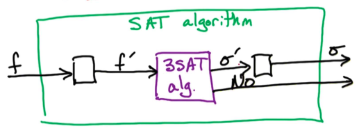

# 12. NP Completeness Proofs

## 12.1. 3-SAT 是 NP-Complete的证明

首先我们知道SAT问题属于NP-Complete，然后我们将用到 Cook-Levin Theorem来证明 3-SAT问题也属于NP-Complete
* 首先要证明的是3-SAT问题属于NP类问题。这个证明非常直观
* 然后，我们需要找一个已知的NP-complete问题。这里，我们知道的是SAT是一个NP complete问题，所以我们必须找到并证明一个从SAT $\rarr$ 3-SAT问题的reduction

有了SAT $\rarr$ 3-SAT问题的reduction后，意味着对于每个 NP类中的问题，都有从 问题A $\rarr$ SAT的reduction。又因为我们有来从SAT $\rarr$ 3-SAT问题的reduction，所以就有从问题A $\rarr$ 3-SAT 的reduction了。那如果我们有3SAT问题的多项式时间的算法，那对于每个NP类中的问题，我们都有能够在多项式时间内解决问题的算法（因为我们已经能将每个NP问题 reduce成 3-SAT问题）

**证明：**
```
Given 3-SAT input $f$ 和 True/False assignment for $x_1, \dots, x_n$

For each clause $C\in f$:
    在 O(1) 时间可以判断至少一个 变量是否满足。所以总时间应该是O(m)
```

每个变量都需要一个 真/假 值，所以就一个个试过去。如果每个括号 C 都能被满足，那么 f 就成立。每个括号内最多3个变量，所以需要 O(m) 的时间验证 f 是否为真。所以证明了 3-SAT问题是 NP问题


如下图，我们知道了 f ，然后我们要将 f 变换成 3-SAT 问题的input，这个变换后的结果我们用 f' 表示。
<p></p>
由于 f 可能是很长的 式子，里面可能会有 某些clauses 里有 n 个变量 x。但3SAT问题限制每个clause里最多有 3 个变量x。所以我们必须将给出的 f 变换成满足 3-SAT问题的形式。

当我们能找到某种满足条件的 assignment $\sigma '$ 使得 f' 成立，那么就能将该 assignment 反变换成满足 原初 SAT 问题的形式。另外我们希望，如果3-SAT公式 f' 没有解，我们希望原初问题 f 也同样没有解。

现在我们要：
1. 为 SAT问题取一个 input  f，然后创建3-SAT问题的input f'；
2. 当有了满足3-SAT的解$\sigma '$后，要能够将其变换成满足 原SAT问题的 assignment
3. 然后要保证$\sigma '$ 满足 f'

如此一来，当且仅当 该变换后的output $\sigma$ 满足原SAT问题时，assignment $\sigma '$是3-SAT问题的解。

例子：

$f=(x_3)\lor(\bar{x_2} \wedge x_3 \wedge \bar{x_1} \wedge \bar{x_4})\lor(x_2 \wedge x_1)$

我们分别用 $C_1, C_2, C_3$表示这三个括号的式子。

我们引入一个新变量$y$，并让$C_2'=(\bar{x_2}\wedge x_3 \wedge y) \lor (\bar{y} \wedge \bar{x_1}\wedge\bar{x_4})$；同时声明：$C_2$ is satisfiable 和$C_2'$ is satisfiable 这二者是等价的。

我们先来证明从左到右，即从$C_2$ is satisfiable 到$C_2'$ is satisfiable。这里我们需要找到一种assignment，使得其满足$C_2'=(\bar{x_2}\wedge x_3 \wedge y) \lor (\bar{y} \wedge \bar{x_1}\wedge\bar{x_4})$为真。那我们可以让：
$x_2=F; x_3=T; x_1 = F; x_4=F$。

然后我们考虑 
* $x_2=F$或者$x_3=T$是否正确。该组合是$C_2$的第一个括号。若 $x_2=F;或 x_3=T$那么$y=F$
* 同理，对于第二个括号，如果$x_1=F; 或x_4 = F$，那么$y=T$。


反过来看从 $C_2$ is satisfiable $\larr$ $C_2'$ is satisfiable。如果我们忽略$y$，无论如何给 $x_1, x_2, x_3, x_4$赋值，都能让$C_2$成立。

所以我们有两种情况：
1. $y=T$ - $C_2$能被满足，所以$C_2'$中的两个括号也都为真。由于$y=T$，所以$x_1, x_4$至少有一个为False。
2. $y=F$ - 说明$x_2=F \text{ or } x_3=T$，此时$x_2=F$意味着该assignment能满足 $C_2$，且若$x_3=T$那么该assignment也能满足 $C_2$

综上，任何四种情况（$y=T, x_1=F或x_4=F或y=F, x_2=F或 x_3=T$）下，我们都有满足$C_2$的assignment。所以如果忽略掉$y$，每个情况都满足$C_2'$，也都满足$C_2$。这就成功建立起了reverse implication（反向推导），进而说明两个方向都成立

总结来说，当我们有一个括号大小为 k 的真假式，要拆分成3-SAT 也就是括号大小最大为3 的真假式，那我们需要创建 k-3 个新的变量；新创建 k-2 个括号从句。例如，当我们有 $C=(\bar{x_2}\lor x_3\lor \bar{x_1} \lor \bar{x_4}\lor x_5)$，我们需要拆成：$C'=(\bar{x_2}\lor x_3\lor \lor y)\wedge (\bar{y}\lor \bar{x_1}\lor z)\wedge (\bar{z}\lor\bar{x_4}\lor x_5)$。这里我们引入了两个新的变量 $y, z$，并将原来的式子拆分成了k-2 = 5-2 = 3个括号从句


## 12.2. Big Clauses
总结上面的规律，有下面的通用形式，即对于一个有 $k$个变量的括号从句 $C=(a_1\lor a_2 \lor \dots \lor a_k)$我们可以将其变成下面的形式：

$C'=(a_1\lor a_2\lor y_1)\wedge(\bar{y_1}\lor a_3 \lor y_2)\wedge (\bar{y_2}\lor a_4 \lor y_3)\wedge \dots \wedge (\bar{y_{k-4}}\lor a_{k-2} \lor y_{k-3})\wedge (\bar{y_{k-3}}\lor a_{k-1}\lor a_k)$

当且仅当 C' is satisfiable的时候，C is satisfiable。

所以重新回看原来的问题，任何大小大于3 的SAT问题，都能变换成 3-SAT问题，并套用上面的公式。

下面是对 k-SAT 问题能够转换为 3-SAT 问题的证明：

1. 正向证明 $C \rarr C'$
我们用$a_i$表示第一个为真的 变量，那么当$i=1$，就说明至少第一个clause是True。当$i>=2$，说明$a_i$出现在第 i-1 个clause中，意味着 C'的第 i-1 个clause为真。

若$i=4$，那么$a_4=T$，且$(\bar{y_2}\lor a_4\lor y_3)$为真，所以我们可以忽略这个clause。那前 i-2 个clauses如何判断真假？—— 我们可以利用这些 y。我们让 $y_1, y_2$ 为真，或者通用的来说，让$y_1, \dots, y_{i-2}$为真，此时我们发现前 i-2 个clause都是真。然后我们要利用 这些 y 的 “非”形式来判断 第 i-1 个clause 之后的clauses。也就是判断 $\bar{y_{k-4}}, \bar{y_{k-3}}$，或者通用的来说，我们将$y_{i-1},\dots,y_{k-2}$都定义为假。这样就能让第 i-1 个clause之后的所有clauses都为真。如此一来，所欲哦的clauses都为真，就能证明正向是成立的。

2. 反向证明 $C' \rarr C$
那么，我们对这些原始的 k 个字母和这些辅助的 k-3 个变量进行赋值，使得它们满足 C’。我们将证明存在一个满足 C 的赋值。  
我们将忽略这些辅助变量，并证明这些是原始 k 个字母的赋值，使得它们满足原始子句。  
现在，为了满足这个子句C，我们只需要证明这些字母中至少有一个被设置为真。假设情况并非如此。假设所有这些k个字母都被设置为假。在这种假设下，是否可能满足C’？我们将证明这是不可能的。  
 
现在假设我们有一个满足C’的赋值。因此它满足所有这些子句。让我们看看第一个子句。现在假设a1和a2被设置为false。因此前两个字母不满足。因此第三个字母必须满足。这意味着$y_1$必须被设置为true。这是在这种假设下满足这个子句的唯一方式。 同样，让我们看看第二个子句。我们看到$y_1$为真。因此，这个字母未被满足。此外，我们假设a3被设置为false。因此，这个字母未被满足。因此，我们必须满足这个第三个字母，$y_2$。因此，y2必须被设置为True。  
 
继续，看看倒数第二个子句。 为了满足这个倒数第二个 
子句，我们必须满足这个字面量——我们必须将 $y_{k-3}$ 设置为真。 现在看看最后一个子句，其中 $y_{k-3}$ 被设置为真。 因此，这个字面量未被满足。 同样，最后两个字面量未被满足，因为它们被设置为假。 因此，这个子句不满足。这意味着C'不满足。这是矛盾的。


---
## 12.3. Practice Problems

- [DPV] 8.3: Stingy SAT
- [DPV] 8.8: Exact 4-SAT


