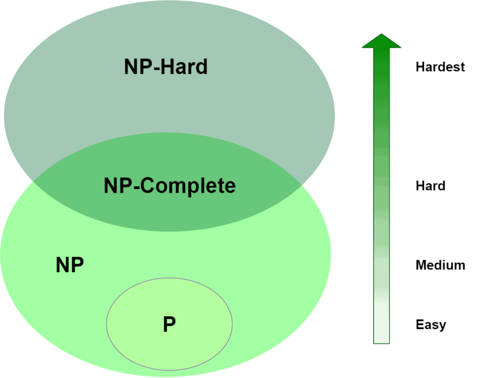
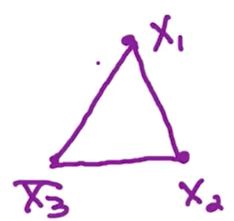
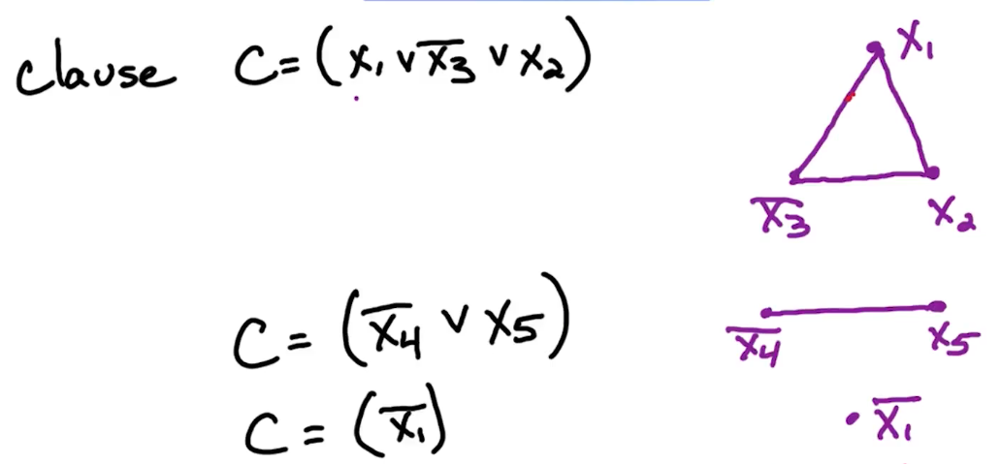
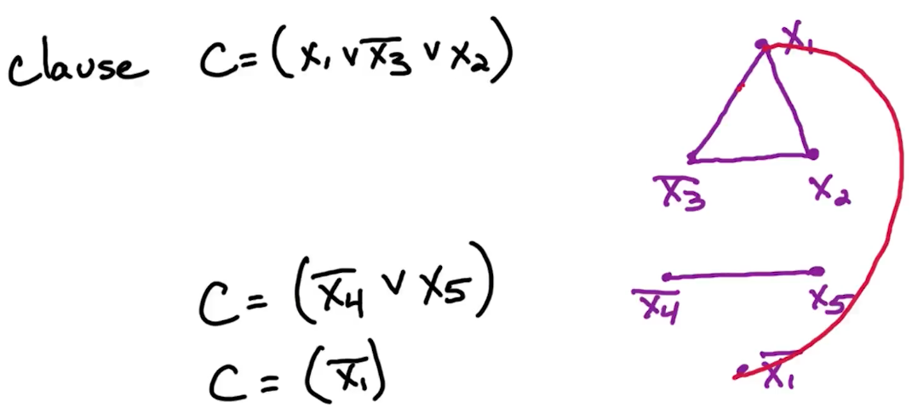
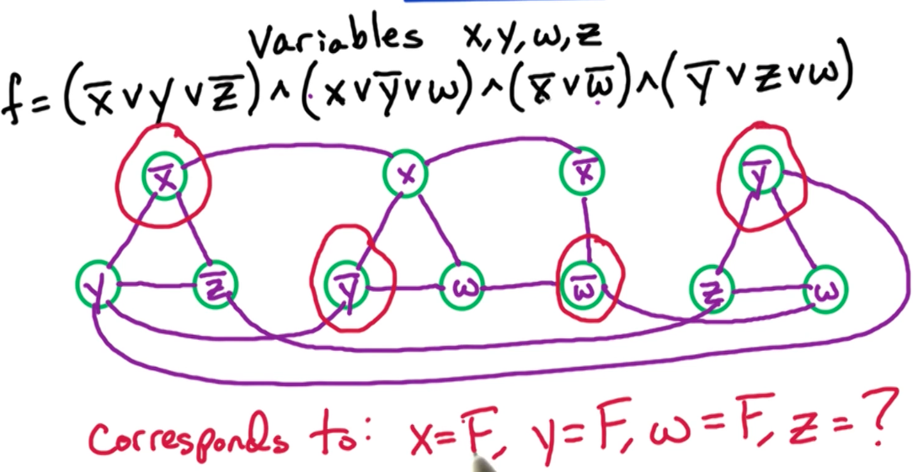
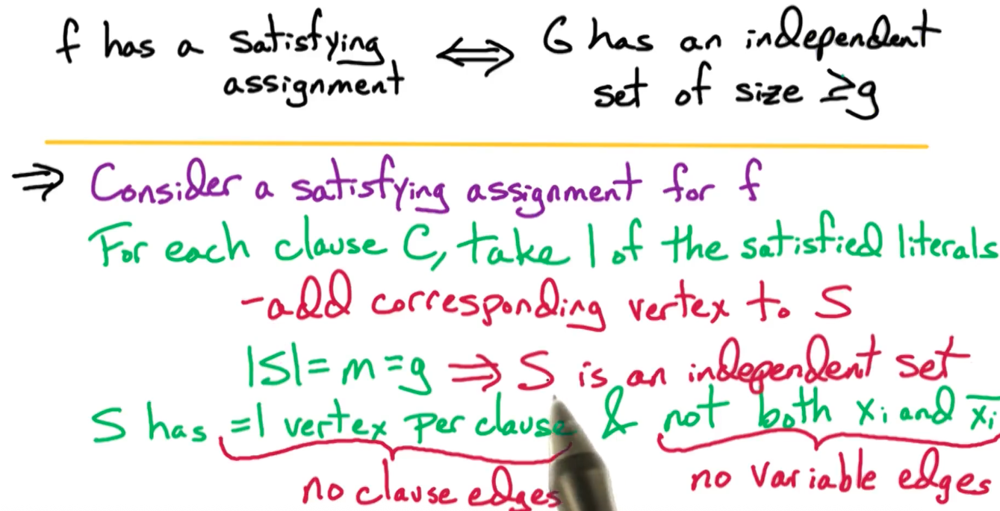
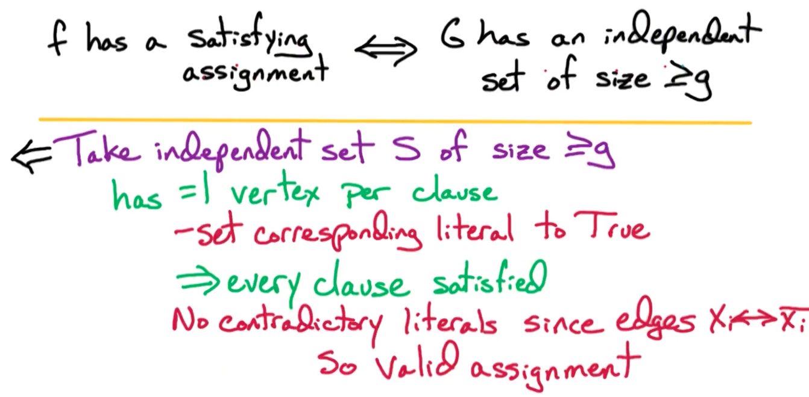
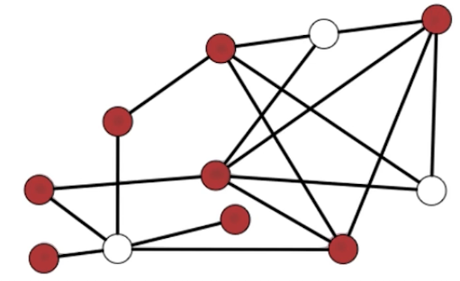

# 13. Graph Problems

## 13.0. Independent Set

什么是Independent Set？ —— 假设我们有一个无向图 G，如果它的某个节点的子集满足 “任意两个该子集中的节点都无法形成一条边”，那么这个子集就是 Independent Set

所以只要简单的判断是否形成了边，就能判断一个子集是不是 IS。因此，空集也是IS。比较难的问题是如何找到最大IS

问题：Max IS Problem
- input: undirected graph G = (V, E), goal $g$
- output: IS $S$ of max size


Max IS问题是不是NP问题？ —— 不是。因为如果给了一个子集，我们无法在多项式时间内验证是否该子集是最大子集。我们唯一能验证这个子集是否是最大子集的方法就只是“是否有一个算法能在多项式时间内解决该问题”。


另一个问题：IS problem

- input: undirected graph G = (V, E)
- output: independent set S with size $|S| \geq g$ if one exists and no otherwise
Theorem: <span style="color: cyan">The IS problem is NP-complete</span>

**证明 - IS 问题是NP-Complete问题**

需证明：
```
问题： IS问题是NP-Complete
  ├─ 1. IS $\in$ NP （即，需要多项式时间来验证一个解的正确性）
  ├─ 2. A $\rarr$ 3SAT $\rarr _{r_2}$ IS
  │  ├─ forward implication (3SAT => IS)
  │  │  └─ ..
  │  └─ reverse implication (IS => 3SAT)
  │  └─ ..
  └─ ..
```
1. IS问题属于NP问题。这里我们已知 无向图G 和 IS size g，以及某个解 S。


<p></p>

* P 问题： 最简单，能做出来能验证出来
* NP问题：不能做出来，但能验证出来
* NP-Complete： NP中最难的问题，无法验证出来
* NP-Hard：不一定属于NP问题

---

## 13.1. IS问题是NP-Complete

1. 证明 IS问题是 NP问题 - input 图G 和大小g，以及一个待验证的解 S，我们已经能在$O(n^2)$时间里验证所有节点对$x, y\in S$，且任何的边$(x, y)\not\in E$
2. 我们能在多项式时间O(n)时间里验证 |S| >= g

3. 然后我们找到一个已知的NP问题3SAT，尝试找到从3SAT $\rarr$ IS 问题的归约。

> 对于3SAT $\rarr$ IS 问题的归约，我们先定义3SAT问题为：已知$x_1, \dots, x_n, c_1,\dots, c_m$，每个$c_i$的大小$|c_i|\leq3$。我们要把3SAT的 input 转化为 IS 问题的input G, g。我们的思路是：对于每个$c_i$，创建$|c_i|$个节点 。又因为每个$|c_i|\leq 3$，所以构建出的图中有最多$3m$个节点。

于是，我们引入两种边：
1. Clause edges - 例如$c=(x_1\lor \bar{x_3}\lor x_2)$

<p></p>

这种构建方式下，最终得到的independent set S的大小最大为 1 ($|S| \leq 1$)。又因为 $g=m$，所以，最终每个clause只有一个节点。（如下图）你得从每一个clause中选一个节点。假设我们选了$\bar{x_1}=True, x_5=True, \bar{x_1}=True$，你会发现$x_1$的值出现了矛盾，因为我们既要满足3SAT问题（让 $f=True$），又要在图 G 中找到 g =m 个独立的节点。这时就需要引入“variable edges”这个概念了

<p></p>

2. Variable edges - 在上面的基础上我们连接$x_1, \bar{x_1}$，如下图，于是就使得同时选出$x_1,\bar{x_1}$变得不可能

<p></p>


例子：

<p></p>

在这个例子里，我们先是构建了图，然后我们能推断出 
* x = F（由于第1个clause）
* y = F（由于第2个clause） 
* w = F（由于第3个clause）
* z = 暂时不能确定。


### 13.1.1. 证明：

**前向：**
假设有一个满足$f$的assignment，对于每个clause $c_i$，我们取$c_i$中的某一个literal，并添加到最终的 independent set $S$中，如此一来，由于一共有 $|S|=m=g$个clause，所以 S的大小为 g (= m)。
<p></p>

又因为，
* S 仅从每个clause中取 1个 节点 （意味着没有clause edge被选出来）；
* 且 S中不同时包含 互补的 literal，例如 $x_i 和 \bar{x_i}$，所以没有variable edge被选出来

所以没有任何一条边被选出来，所以 如果 3-SAT的$f$ 存在solution，那么 IS问题也存在，即证前向归约过程。

**后向**

对于后向过程，我们假设有了 IS问题的一个可行解 $S, |S|\geq g = m$。这意味着，每个clause中卡好有一个节点被选中在 S，将被选中的节点 设为 True。这就意味着每个clause的结果都是True，这样就能让3-SAT问题的$f$ = True。又因为我们有 variable edges $ x_i \harr \bar{x_i}$，这保证了不会出现某个变量值 出现“矛盾”的情况，进而保证了assignment的合法性。
<p></p>


## 13.2. Clique问题

Clique = Fully Connected Subgraph

Clique的正式定义是：对于一个undirected graph，G=(V,E)，如果一个节点的子集$S\subset V$满足对于所有$S$中的节点对$x,y\in S$，都有$(x, y)\in E$，那么$S$就是Clique。即这个子集$S$的任意两个节点之间都存在一条边将二者连接。某个节点自己也是Clique。

此类问题的难点在于如何找到最大的Clique $S$子集

### 13.2.1. 证明 Clique 问题是NP-Complete

第一步：

证明Clique问题属于NP问题。给定一个 undirected graph G=(V, E), g 和 一个解 S，若能在多项式时间内验证S的正确性。不难看出，直接做一个 nested for loop，遍历每一对节点就能完成，所以时间是 $O(n^2)$。然后检查$|S|\geq g$需要 O(n)时间。所以该问题属于NP问题

第二步：

找到某个已知为NP-complete的问题A，然后找到 A $\rarr$ Clique的归约
So far我们已知的NP Complete问题是 SAT、3SAT、IS。这里面IS和Clique问题最相似，都是Graph问题，所以我们取IS，来找到 IS $\rarr$ Clique的归约

* Clique问题说的是所有在S集合中的节点之间都有边与之直接相连
* IS问题说的是 S集合 中的任意两个节点之间都不形成边

所以Clique中，所有边都在S中；而IS里，没有边存在于S中。那也就是说Clique问题刚好是IS问题的反面。

第三步：

我们构建一个反图，$\bar{G}=(V,\bar{E}), \text{ where } \bar{E}=\{(x,y) | (x,y)\not\in E \}$。如果随便画一个图就会发现，反图$\bar{G}$里，如果两个节点之间有边相连，说明原图$G$里这两个节点一定不相连，意味着这两个节点在原图里属于 independent set，且这两个节点在$\bar{G}$里恰好是 Clique。

找到从 IS $\rarr$ Clique 问题的归约。刚刚反图的构建已经给出了归约，即对于G=(V,E)，构建反图$\bar{G}$ （需要$O(mn)$的时间），然后将$\bar{G}, g$作为Clique问题的input，如果我们有Clique问题的解$S$，那么这个$S$就是 IS 问题的解。如果没有解，那么IS问题也无解。（使用了 If A has solution, then B has solution. If A has no solution, then B has no solution）。

上面正向的归约，同时也是反向的归约。因此Clique问题是NP-Complete的


## 13.3. Vertex Cover问题

该问题说的是，在一个undirected graph G=(V, E)中，如果某个节点子集$S\subset V$满足：图G中任意一条边 $(x, y)\in E$都有至少一个节点在子集$S$中，那么这个子集$S$就是Vertex Cover。

<p></p>

常见的较复杂的VC问题是对 budget 有限制，即给了一个图G=(V,E)和budget b，要找到vertex cover $S$，使得$|S|\leq b$。No otherwise


### 13.3.1. VC问题是NP-Complete证明

第一步：

证明VC问题属于NP 问题，即证VC问题需要多项式时间来验证一个解的正确性。
* 首先是看对于每个边$(x,y)\in E$,是不是$x, y$二者至少有一个存在于$S$里，这需要$O(n+m)$时间
* 然后看$|S|$是不是$\leq b$，这需要$O(n)$时间


第二步：

找到某个已知的NP-complete问题A，然后找到该问题A $\rarr$ VC问题的归约。这里我们选 IS 问题作为问题 A，然后找到 IS $\rarr$ VC问题的归约

假设我们有一个vertex cover set $S$，这意味着，对于原图G中的每条边 $(x,y)\in E$，它的两个节点$x, y$中至少有一个是在$S$里的。如果我们取$S$的补集$\bar{S}$（也就是原图中不在$S$集合中的其他节点），那么意味着原图中的每条边 的两个节点$x,y$最多有一个节点在$\bar{S}$中。这个性质就等同于 Independent Set 的性质（即 IS中没有任何两个节点能构成一条边）。因此我们说 $\bar{S}$就是一个 independent set。于是，我们找到了 正向归约 IS $\rarr$ VC

反向归约：同理，我们取independent set $\bar{S}$，对于原图中每个边$(x, y)\in E$，原图G中任意两个节点所形成的边的节点$x, y$最多有一个($\leq 1$) 出现在$\bar{S}$中。反之，原图G 中任意两个节点所形成的边的节点$x, y$至少有一个($\geq 1$) 出现在$S$中。

对于IS问题的input $G=(V,E), g$，我们让$b=n-g$，其中$n$是节点个数。然后对$G, b$运行

G的vertex cover size $\leq n-g \harr $ G的 independent set size $\geq g$

第三步:

IFF - 有了VC的solution $S$，可以返回$\bar{S}$作为 IS问题的解；如果VC问题无解，则IS问题无解（使用了 If A has solution, then B has solution. If A has no solution, then B has no solution）。


## 13.4. Practice Problem

- [DPV] 8.4 NP-completeness error
- [DPV] 8.10 proof by generalization
- [DPV] 8.14 Clique + IS
- [DPV] 8.19 kite 


