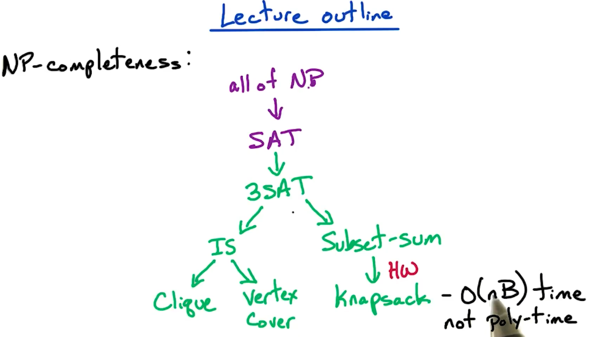
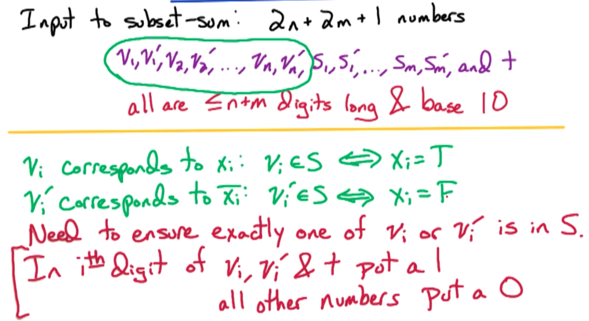
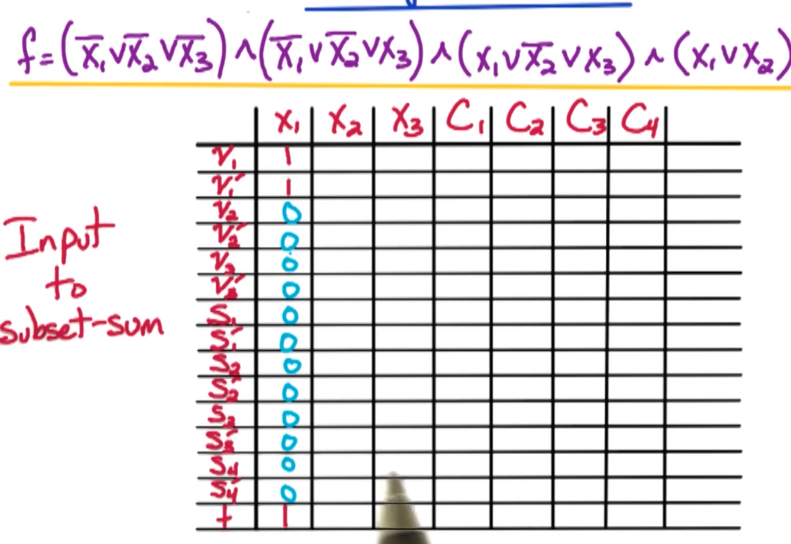
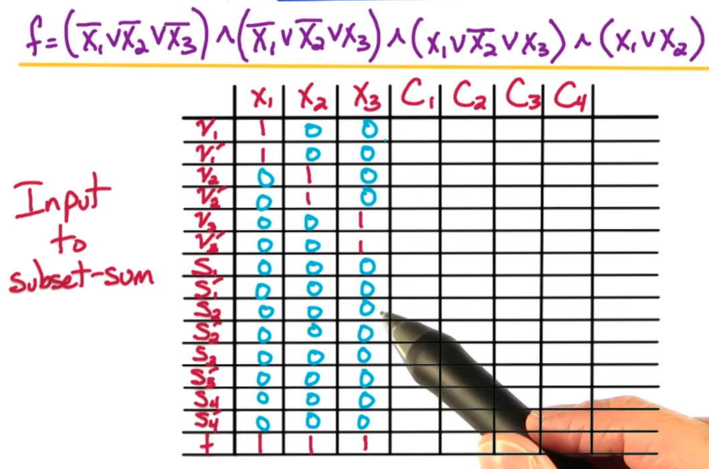
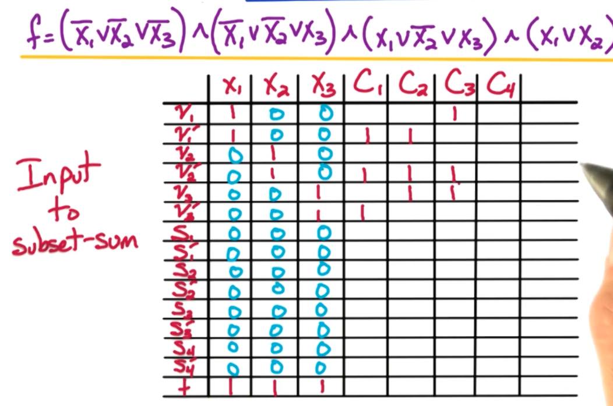
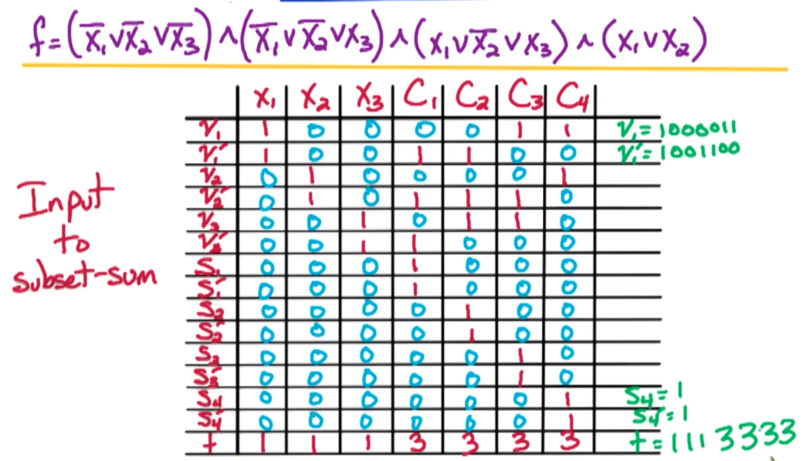

# 14. Knapsack

## 14.1. Subset sum (SSS)问题

- input - positive integers $a_1, \dots, a_n, t$
- output - subset $S$ of $\{1, \dots, n\}, \text{where }\sum_{i\in S}a_i=t$; No otherwise.

给了$n+1$个正整数，要从$a_1, \dots, a_n$这$n$个正整数中找到一个子集$S$，使得$S$中所有正整数之和等于$t$。如果没有解，返回No

### 14.1.1. 证明定理：SSS问题是NP-Complete

第一步：

证明SSS问题属于NP问题：

给定positive integers $a_1, \dots, a_n, t$以及一个待验证的解$S$，我们要在多项式时间内验证$S$中的元素之和等于 t 。需要的时间为 $O(n \log t)$因为在大整数运算时，假发操作本身并不是O(1)时间，而是取决于计算的整数的位数。由于最大整数为 t，所以需要 log(t) 位，因此时间为 O(log t)。所以该问题属于NP，因为能在多项式时间$O(n\log t)$内验证一个解是否正确。

第二步：

找归约。这里我们将讨论 3-SAT $\rarr$ SSS 。

SSS的input是 $2n+2m+1$个数字$v_1,v_1',v_2,v_2',\dots,v_n,v_n',s_1,s_1','\dots,s_m,s_m'$且所有数字都是$\leq n+m$的位长，且底数是10。所以$t\approx 10^{n+m}$

我们用上面$v_1, v_1'$来表示 $x_i=T$和$x_i=F$，那么在3SAT问题里，就意味着每一对v_i, v_i'$里，恰好有一个是在最终解$S$里。我们可以在第 $i$ 位，让$(v_i, v_i')=1$，其他的位都是 0.

看下面的例子：

首先我们让行表示位 $v_1,v_1',v_2,v_2',\dots,v_n,v_n',s_1,s_1','\dots,s_m,s_m'$以及一个额外的目标 $t$。让列表示3SAT问题中的 变量和从句$x_1, x_2, x_3, C_1, C_2, C_3,C_4$

根据上面所说，我们让某一对$(v_i, v_i')=1$，然后让其他的位 为0，然后让  t = 1.

然后取$ i=2$，填充 $x_2$这一列；然后取$ i=3$，填充 $x_3$这一列；如下图

上面的表里，前$n$列与3SAT中的变量有关；从第$n$列开始往后的$m$列与3SAT中的从句有关

最后这$m$列，我们这样填写：

- $C_1$从句有$\bar{x_1},\bar{x_2},\bar{x_3}$，所以让$v_1'=1, v_2'=1, v_3'=1$，其余为0
- $C_2$从句有$\bar{x_1},\bar{x_2},x_3$，所以让$v_1'=1, v_2'=1, v_3=1$，其余为0
- $C_3$从句有$x_1,\bar{x_2},x_3$，所以让$v_1=1, v_2'=1, v_3=1$，其余为0
- $C_4$从句有$x_1, x_2$，所以让$v_1=1, v_2=1$，其余为0

然后你会发现表的右下角（从$(S_1,C_1)$开始到最右下角）这个部分还空着。我们用作buffer。

- 如果所有3的literal都能被满足，那我们能得到这一位上 想要的 t 值。
- 如果只有1或2个literal能被满足，这时候就需要buffer这个区域。我们让$(C_{n+j}, S_j)=1; (C_{n+j}, S_j')=1$。

这就能让 当只有1或2个literal被满足时，我们还是能通过buffer $(C_{n+j}, S_j)=1; (C_{n+j}, S_j')=1$，来让这列的和为 t 在这一位的值。

- 最后，如果 3个literal都不能被满足，意味着当前这一位 （列）的加和 最多是 2，即 $(C_{n+j}, S_j) + (C_{n+j}, S_j')=1+1=2 \not= 3$，此时返回 No。

第三步：正向证明

我们取某一个SSS问题的解 $S$，对于前$n$个digits（$i, \text{ where } 1\leq i\leq n$），要让第$i$个digit为1，我们要能恰好让$v_i, v_i'$二者之一在$S$中。
- 若让$v_i\in S, \text{ then } x_i=True$；
- 若让$v_i'\in S, \text{ then } x_i=False$

然后我们看后$m$个从句。我们还是取$S$作为SSS问题的某一个解。对于每个后$m$个位（$n+j \text{ where } 1\leq j\leq m$）。后面这$m$位，我们要让 和为3.
- 若3个literal都能满足，则不需要加buffer就能让当前位 的加和为3
- 若1或2个literal能被满足，则需要考虑加2 或 1 个buffer来让当前位 的加和为3
- 若0 个literal被满足，则为No

> 列之和为3 意味着什么？—— 意味着当前clause能被满足

第四步：反向证明

SSS $\larr$ 3SAT

我们取一个可行的assignment作为3SAT问题的解。
- 若 $x_i=T, \text{ add } v_i \text { to } S$
- 若 $x_i=F, \text{ add } v_i' \text { to } S$

意味着，对于第$i$位，有且仅有一个$v_i\text{或}v_i'$被加入到最终解$S$里

然后对于第$j$个clause $c_j$，至少要有一个literal被满足，才能让第$j$列的和 为 3。由于有$S_j, S_j'$，所以能保证第$n+j$列的和 为3。又因为前$n$列也是正确的，所以能证明反向归约是正确的

--- 
## 14.2. 证明Knapsack问题是NP-Complete问题

