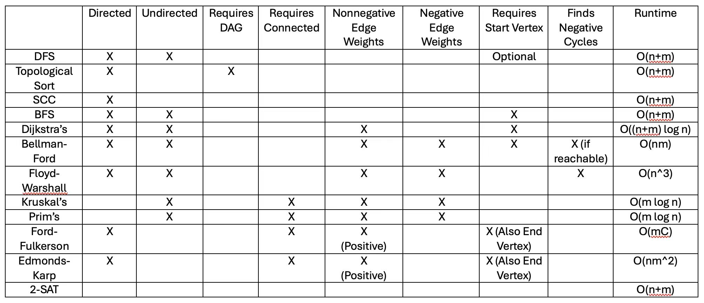

| Chapter  | Questions |
|:------|:---:|
| DP3 |   |
| GR1   |  Quiz4, HW5, DPV3.3 |
| GR2   |  DPV3.4, DPV3.5, DPV3.15 |
| GR3   |  HW6, DPV4.14, DPV5.1, DPV5.2, DPV5.9 |
| MF1   |  Quiz5 |
| MF2   |  HW7 |
| MF4   |  HW8 |

---
### Available Blackbox Algorithms

1. DFS(G=(V,E)) $\rarr$ 
    - `ccnum[]` a list containing the connected component number of the indexed vertex.
    - `prev[]` a list containing the parent vertex of the indexed vertex
    - `pre[]` a list containing the pre-visit number for the indexed vertex
    - `post[]` a list containing the post-visit number for the indexed vertex
    - $O(n+m)$

2. TopoSort(G=(V,E)) $\rarr$
    - `order[]` a list of vertices, sorted in topological ordering from source to sink
    - $O(n+m)$

3. SCC(G=(V,E)) $\rarr$
    - `G_SCC = (V_SCC, E_SCC)` - The SCC metagraph, provided in adjacency list format
    - $O(n+m)$

4. BFS(G=(V,E)) $\rarr$
    - `dist[]` a list containing the unweighted distance from the starting vertex to the indexed vertex for all vertices in G
    - `prev[]` a list containing the parent vertex of the indexed vertex
    - $O(n+m)$

5. Dijkstra(G=(V,E)) $\rarr$
    - `dist[]` a list containing the weighted distance from the starting vertex to the indexed vertex
    - `prev[]` a list containing the parent vertex of the indexed vertex
    - $O((n+m)\log n)$

6. BellmanFord(G=(V,E)) $\rarr$
    - `dist[]` a list containing the weighted distance fromt the starting vertex to the indexed vertex for all vertices in G
    - `prev[]` a list containing the parent vertex of the indexed vertex
    - `iter[][]` - a 2d list containing the first indexed iteration's shortest path from the starting vertex to the second indexed vertex
    - $O(nm)$

7. FloydWarshall(G=(V,E))
    - `dist[][]` a 2d list containing the weighted distance from the first indexed vertex to the second indexed vertex
    - `iter[][][]` a 3d list containing the first indexed iteration's shortest path from the second indexed vertex to the 3rd indexed vertex
    - $O(n^3)$

8. Kruskal(G=(V,E))
    - `edges[]` a list of `n-1` edges that represent a MST for the input graph
    - $O(m\log n)$

9. Prim(G=(V,E))
    - `prev[]` a list containing the parent vertex of the indexed vertex
    - $O(m \log n)$

10. Ford-Fulkerson(G=(V,E))
    - `flow[]` a list of edges representing the amount capacity used per each indexed edge such that the flow is maximized from the starting vertex to the ending vertex
    - `C` the value of the max flow from the starting vertex to the ending vertex
    - $O(mC)$

11. Edmonds-Karp(G=(V,E))
    - `flow[]` a list of edges representing the amount of capacity per each indexed edge such that the flow is maximized from the starting vertex to the ending vertex
    - `C` the value of the max flow from the starting vertex to the ending vertex
    - $O(nm^2)$

12. 2SAT(CNF)
    - `assignments[]` a list indexable by the variables that back the original input formula containing whether that variable is set to `true` or `false`.
    - $O(n+m)$

---
### Structure of Solutions
1. Algorithm

    In words, describe how to solve the problem. Bulleted points are fine

2. Justification of Correctness

    Why your algorithm works in words.

3. Runtime Analysis

    Worst case big-O runtime, including any pre/post-processing steps

---

[DPV 3.5] (Wrong) - The reverse of a directed graph G = (V, E) is another directed graph $G^R=(V,E^R)$ on the same vertex set, but with all edges reversed; that is, $E^R={(v, u):(u,v)\in E}$. Give a linear-time algorithm for computing the reverse of a graph in adjacency list format.

a. Algorithm
Since we want to find the reverse graph of the given directed graph G, we can simply run a dfs, where every time it finds an edge, reverse the starting and ending vertices 

b. Justtification of Correctness
Since the dfs algorithm guarantees to traverse every edge in any directed graph G and we reverse each edge during each recursion, therefore, this algorithm guarantees the correctness.

c. Runtime Analysis
O(n+m)

[DPV 3.3] Run the dfs-based topological ordering algorithm on the following graph. Whenever you have a choice of vertices to explore, always pick the one that is alphabetically first.

- a. Indicate the pre and post numbers of the nodes
    - A    C    D    F    G    G    H    H    D    E     F     E     A     B     C     B
    - 1    2    3    4    5    6    7    8    8    10    11    12    13    14    15    16
    - pre pre  pre  pre  pre  post pre  post post  pre  post  post  post  pre  post  post
    
- b. What are the sources and sinks of the graph?
    - Source: A and B
    - Sink: G and H
- c. What topological ordering is found by the algorithm?
    - B, C, A, E, F, D, H, G
- d. How many topological orderings does this graph have?
    - Only 1 topological ordering if we have to follow the "alphabetical rule"

[DPV 3.4] Run the strongly conected components algorithm on the following directed G. When doing dfs on $G^R$: whenever there is a choice of vertices to explore, always pick the one that is alphabetically first

In each case, answer the following questions:
1. In what order are the strongly connected components (SCCs) found?
    - (i) {C,D,F,J} $\rarr$ SCC1; {G,H,I} $\rarr$ SCC2; {A} $\rarr$ SCC3; {E} $rarr$ SCC4; {B} $\rarr$ SCC5
    - (ii) {D, G, H, F, I} $\rarr$ SCC1; {C} $rarr$ SCC2; {A, E, B} $\rarr$ SCC3
2. Which are source SCCs and which are sink SCCs?
    - (i) source SCCs: {C,D,F,J}  sink SCCs: {B}, {E}
    - (ii) source SCCs: {D, G, H, F, I}  sink SCCs: {A, B, E}
3. Draw the metagraph (each meta-node is an SCC of G)
4. What is the minimum number of edges you must add to this graph to make it strongly connected?
    

[DPV 3.15] The police department in the city of Computopia has made all streets one-way. The mayor contends that there is still a way to drive legally from any intersection in the city to any other intersection, but the opposition is not convinced. A computer program is needed to determine whether the mayor is right. However, the city elections are coming up soon, and there is just enough time to run a linear-time algorithm.

- (a) Formulate this problem graph-theoretically, and explain why it can indeed be solved in linear time. 
    - This city's roads can be represented as a directed graph G=(V,E), where each intersection is a node v in V and each road is a directed edge e in E. Therefore, we only need to run an SCC algorithm starting from any intersection. If there is only 1 single SCC found, then mayor's claim is right. Otherwise, wrong.
- (b) Suppose it now turns out that the mayor's original claim is false. She next claims something weaker: if you start driving from town hall, navigating one-way streets, then no matter where you reach, there is always a way to drive legally back to the town hall. Formulate this weaker property as a graph-theoretic problem, and carefully show how it too can be checked in linear time.
    - Similarly, we create a graph G=(V,E). Also, we run the SCC algorithm starting from the town hall vertex. This algorithm will return a list of SCCs. In the SCC that contains the town hall vertex, if there are more than 1 vertices, then mayor's claim is true. Otherwise, false. The runtime is O(n+m)

---
[DPV 4.14] 【partially correct。可以用Dijkstra替换bellman】You are given a strongly connected directed graph G=(V, E) with positive edge weights along with a particular node $v_0 \in V$. Give an efficient algorithm for finding shortest paths between all pairs of nodes, with the one restriction that these paths must all pass through $v_0$.

1. Algorithm

    For the given graph G=(V,E), where $E=(u,v)$, we run Bellman-Ford algorithm by taking $v_0$ as the starting node and the rest nodes as ending nodes. This will give us a list of shortest paths, L1.
    Next, we build a reverse graph of $G^R=(V,\bar{E})$, where $\bar{E}=(v, u)$. Also, we run a second Bellman-Ford algorithm by taking $v_0$ as the starting node and the rest nodes as ending nodes. This will also give us a list of shortest paths, L2. 
    Post-processing - in the given graph G, if we want to find the shortest path that passes $v_0$ between any 2 nodes, s and t, we can find the shortest path between $v_0$ and t from list L1. Then find the shortest path between s and $v_0$ from list L2. Put them together will give us the anticipated answer.

2. Justification of Correctness

    The anticipated answer can be constructed by the shortest path from $v_0$ to t and the shortest path from s to $v_0$. This guarantees the final path passes node $v_0$. One thing we need to notice is that $v_0$ is the destination node if we want to find the shortest path from s to $v_0$. Therefore, we need to reverse the graph G before running Bellman-Ford.
    The bellman-ford algorithm returns the shortest path between $v_0$ and the rest nodes in a given graph. Therefore, it will return the optimal solution that satisfies the requirements.

3. Runtime Analysis

    Bellman-ford algorithm twice - O(nm)
    building reverse graph $G^R$ - O(n + m)
    combining 2 shortest paths during the post-processing step - O(n) as we only need to traverse all vertices.

    So, the overall runtime for this algorithm is O(nm)

---
[DPV 4.1]

---
[DPV 4.2]

---
[DPV 4.3] Design and analyze an algorithm that takes as input an undirected graph G=(V,E) and determines whether G contains a simple cycle (that is, a cycle which doesn't intersect itself) of length four. Its running time should  be at most O(|V|^3). You may assume that the input graph is represented either as an adjacency matrix or with adjacency lists, whichever makes your algorithm simpler.

1. Algorithm

    for all pairs of vertices u and v, we check and see if they share at least 2 neighbor vertices x and y.

    If yes, then return true. Otherwise false.

2. Justification of correctness

    This question is essentially asking if 2 vertices share two same neighbors. If so, then u, v, x, y can form a simple cycle with length 4. Therefore, this algorithm works.

3. Runtime analysis

    - checking node pairs will need O(n^2) time. Each time we need to find the 2 shared nodes. This will need O(n)
    - overall O(n^3)

---
[DPV 4.8] [Wrong] - Professor F. Lake suggests the following algorithm for finding the shortest path from node s to node t in a directed graph with some negative edges: add a large constant to each edge weight so that all the weights become positive, then run Dijkstra's algorithm starting at node s, and return the shortest path found to node t.

Is this a valid method? Either prove that it works correctly, or give a counterexample.

This is wrong. A counterexample is a graph like this:

A -> B; B -> C; C -> D; C -> E; D -> B; B -> F
(A, B) = 2; (B, C) = 1; (C, D) = -5; (D, B) = 3; (C, E) = 2; (D, F) = 4

And, we want to find the shortest path from A to E. The expected answer is A -> B -> C -> D -> B -> C -> E. The total cost is 3.

However, by applying the professor's method, the shortest path will be A -> B, -> C -> E

---
[DPV 4.11] Give an algorithm that takes as input a directed graph with positive edge lengths, and returns the length of the shortest cycle in the graph (if the graph is acyclic, it should say so). Your algorithm should take time at most O(|V|^3)

1. Algorithm
    We run a Floyd-warshall algorithm in the given graph G. This will give us an all-pair shortest paths, L. For a certain starting node s and its every reachable node t, we find all edges that connects t and s, i.e. (t, s). Each time we find an edge (t, s), it will form a cycle with total weight w_i. Next, we do the same thing to the rest of nodes and treat each of them as a starting node s. Finally, we will get a list of weights of cycles formed. Find the minimum one among them and return it to get the final answer.

2. Justification of Correctness
    The floyd-warshall algorithm finds the shortest paths for all node pairs in the given graph G. The nested traversal guarantees to find all cycles and each cycle's total weight. Finally, we simply find the smallest weight among the cycle weight list. If it's empty, then there's no cycle in the given graph G.

3. Runtime Analysis
    Floyd-warshall algorithm takes O(n^3)
    the nested traversal takes O(nm)
    The total runtime is O(n^3) where n = |V| and m = |E|.

---
[DPV 4.12] Give an $O(|V|^2)$ algorithm for the following task. **Input**: An undirected graph G=(V, E); edge lengths $l_e > 0$; an edge $e\in E$. **Output**: The length of the shortest cycle containing edge $e$.

1. Algorithm

    Denote the edge e as (s, t). For the given graph G, let's remove the edge e=(s, t) to get a new graph G'. Next, run the Dijkstra's algorithm to find the shortest path from s to t, P. Finally, output the P U (s,t) as the length of the shortest cycle containing edge e.

2. Justification of Correctness

    Since the final output cycle has to contain the edge e = (s, t), this question can be converted to "find the shortest path from s to t". Therefore, we can run Dijkstra's algorithm to find the shortest path given that all edge lengths $l_e > 0$. Therefore, This algorithm guarantees to work correctly.

3. Runtime Analysis

    - Removing e and assigning weights will take O(1) and O(m) time
    - Dijkstra's algorithm takes O( (n+m) log n) time.
    - Overall runtime will be O((n+m) log n), where n = |V|, m = |E|.

---
[DPV 4.13] [Instead of searching L, you should search edge list E to get the expected runtime] - You're given a set of cities, along with the pattern of highways between them, in the form of an undirected graph G=(V, E). Each stretch of highway $e\in E$ connects two of the cities, and you know its length in miles, $l_e$. You want to get from city s to t. There's one problem: your car can only hold enough gas to cover L miles. There are gas stations in each city, but not between cities. Therefore, you can only take a route if every one of its edges has length $l_e \leq L$.

(a) Given the limitation on your car's fuel tank capacity, show how to determine in linear time whether there's a feasible route from s to t.

1. Algorithm
    - Step 1 - Create a G' = G - {e*}, where e* represents all edges $e\in E$ such that $l_e > L$. In this case, we remove from G all edges whose length is greater than L.
    - Step 2 - Run bfs on G
    - Step 3 - Return if t is reachable.

2. Correctness

    This works because we first remove all highways that our car cannot travel over givne our tank capacity. Once those edges are removed, then all remaining edges can be traveled on with our tank capacity. So, a bfs will give us all cities that can be reached.

3. Runtime
    - remove edges O(n+m)
    - bfs O(m+n)
    - overall runtime O(n+m)

(b) You are now planning to buy a new car, and you want to know the minimum fuel tank capacity that is needed to travel from s to t. Give an $O((|V|+|E|)log|V|)$ algorithm to determine this.

Another solution: Use MST. 
1. Algorithm
    - Step 1 - Given G=(V, E), run kruskal to get an MST M of G.
    - Step 2 run bfs on M, s
    - Step 3 - using prev[] to check the path form s to t and return longest edge.

2. Correctness

    we create an MST which is guaranteed to connect all ndoes using the minimum edges. Since our tank capacity is limited to the max edge, we must take to get from s to t, going over the min edges will minimize our tank capacity. We then run bfs from s over the MST which can only have 1 valid path since it's an MST. This valid path determines our tank capacity needed to get from s to t.

3. Runtime
    - kruskal O(m log n)
    - bfs O(n)
    - overall runtime O(m log n)

1. Algorithm

    We first find the max length from the given graph and denote it as L. Next, we do binary search. Each iteration, we set L' as the current maximum length that the new car can travel, where 0 < L' <= L. Also, in each iteration, we simply run bfs to get a path from s to t such that every edge's length <= L'. Starting from L/2, if we couldn't find such path, then the solution space should be (L/2, L]; otherwise, (0, L/2].
    When done the binary search, the final L' will be the anticipated minimum capacity for the new car.

2. Justification of correctness

    The search space guarantees the optimal solution exists. The binary search rule ensures the solution space narrows down towards the right direction. The bfs algorithm ensures we can find a path from s to t such that the maximum edge length on this path does not exceed the current capacity L' or returns no if it doesn't exist. Therefore, it ensures the correctness of this algorithm

    

3. Runtime analysis

    bfs - O(n+m)
    binary search O(L)
    Overall runtime O((n+m) log L), where L = maximum length of edge in G; n = |V|; m = |E|

---
[DPV 4.20] There's a network of roads G=(V, E) connecting a set of cities V. Each road in E has an associated length $l_e$. There is a proposal to add one new road to this network, and there's a list of $E'$ of pairs of cities between which the new road can be built. Each such potential road $e'\in E'$ has a associated length. As a designer for the public works department you are asked to determine the road $e'\in E'$ whose addition to the existing network G would result in the maximum decrease in the driving distance between two fixed cities s and t in the network. Give an efficient algorithm for solving this problem.

1. Algorithm

    Denote the nodes in E' as (x, y). Denote $x\in X, y\in Y$. Find the shortest paths from s to the rest nodes in X to get dist_s[], denoted as L1, and find the shorest paths from t to the rest nodes in G to get dist_t[], denoted as L2 (using Dijkstra's algorithm). For every edge e'=(x, y) in E', there will be 2 options: one is s -> x -> y -> t; two is s -> y -> x -> t. The shortest length for each  option is: dist_s[x] + length (x, y) + dist_t[y]; and dist_s[y] + length(x, y) + dist_t[x]. We need to find the smaller one from the two. The smaller one represents the shortest path from s to t that passes edge e'= (x, y). Among all such paths, we will do a simple linear scan to find the one that has the smallest total length which will be the final output.

2. Justification of correctness

    This method works becuase it splits the original problem into 2 subproblems, where each subproblem is to find the 1-to-the-rest shortest paths. This can be done by Dijkstra's algorithm. Finally, combine the 2 shortest paths with the corresponding edge e' in E' to result in the shortest path from s to t that passes the edge e'. The final answer is the path with the smallest length among all shorest paths that passes e' in E'. Therefore it ensures the correctness of this approach.

3. Runtime analysis

    - Two Dijkstra's algorithm: O( (n+m) log n)
    - Linear scan: O(m)
    - Overall runtime: O((n+m) log n)

---

[DPV 3.7] A bipartite graph is a graph G=(V, E) whose vertices can be partitioned into two sets $V=V_1 \cup V_2$ and $V_1 \cap V_2=\emptyset$) such that there are no edges between vertices in the same set (for instance, if $u, v \in V_1$, then there is no edge between u and v).

(a) Give a linear-time algorithm to determine whether an undirected graph is bipartite

We can use either dfs or bfs to traverse all nodes in the given graph G. For the current node u and its neighbor node v, if v is not yet colored, then assign color 2 to v (u is already in color 1). If v is in the same color with u, then G is not a bipartite because we found a cycle with "odd length". If v is colored and is with the different color from u, then we found an "even length cycle", then we continue searching for the next node that has not yet been traversed by bfs/dfs. 

(b) There are many other ways to formulate this property. For instance, an undirected graph is bipartite if and only if it can be colored with just 2 colors. Prove the following formulation: an undirected graph is bipartite if and only if it contains no cycles of odd length.

(c) At most how many colors are needed to color in an undirected graph with exactly one odd-length cycle?

---

[DPV 3.8]  Pouring water. We have three containers whose sizes are 10 pints, 7 pints, and 4 pints, respectively. The 7-pint and 4-pint containers start out full of water, but the 10-pint container is initially empty. We are allowed one type of operation: pouring the contents of one container into another, stopping only when the source container is empty or the destination container is full. We want to know if there's a sequence of pourings that leaves exactly 2 pints in the 7- or 4-pint container.

(a) Model this as a graph problem: give a precise definition of the graph involved and state the specific question about this graph that needs to be answered.

(b) What algorithm should be applied to solve the problem?

(c) Find the answer by applying the algorithm

--- 
[DPV 3.11] Design a linear-time algorithm which, given an undirected graph G and a particular edge e in it, determines whether G has a cycle containing e.

1. Algorithm

    First, we denote the nodes on edge e as (u, v). For the given graph G, we remove the edge e and form a new graph G'. Next, we run a bfs algorithm starting from u. If v is reachable, then return true as there is a cycle that contains e. Otherwise, false.

2. Justification of correctness

    This algorithm works, because by removing the edge e, we constructed a new graph where (u, v) does not exist. If there is still a path from u to v, it means there are 2 distinct path from u to v. Therefore, there is a cycle that contains edge e in the original graph G. Otherwise, no

3. Runtime analysis

    - bfs O(n+m)
    - removing edge e O(1)
    - Overall runtime O(n+m) where n = |V| and m = |E|.

--- 

[DPV 3.16] Suppose a CS curriculum consists of n courses, all of them mandatory. The prerequisite graph G has a node for each course, and an edge from course v to course w if and only if v is a prerequisite for w. Find an algorithm that works directly with this graph representation, and computes the minimum number of semesters necessary to complete the curriculum (assume that a student can take any number of courses in one semester). The running time of your algorithm should be linear.

1. Algorithm

    We can construct a DAG G. Then asking the minimum number of semesters to complete the curriculum is equivalent to asking the maximum depth of this graph G starting from source vertices ending at sink vertices. We can run a simple bfs algorithm and compute the number of levels 

2. Justification of currectness

3. Runtime analysis

---

[DPV 3.22] Give an efficient algorithm which takes as input a directed graph G=(V, E), and determines whether or not there is a vertex $s\in V$ from which all other vertices are reachable.

1. Algorithm

    frist, we run the SCC algorithm to get SCC number for each vertex. Starting from any vertex in the source SCC, we run dfs. If all SCCs are traversed, then there is a vertex s from which all other vertices are reachable. Otherwise, there's no such vertex.

2. Justification of correctness.

    The SCC algorithm correctly build a metagraphs for the graph G where all nodes in the same SCC are reachable to each other. If there are 

---
[DPV 3.24] Give a lienar-time algorithm for the following taks. Input: A directed acyclic graph G. Question: Does G contain a directed path that touches every vertex exactly once?

1. Algorithm

    run topological sort and get topo order for each node, v1, v2, ... vn. For each pair of (vi, v_i+1), if any edge (vi, v_i+1) does not exist, then no; Otherwise, yes.

2. Justification of correctness

    In a DAG, any path that touches every node exactly once must follow a topological order because edges only go forward in topological order. The only possible hamiltonian path is therefore the topological ordering itself. So, checking whether each consecutive pair in the topological order has a direct edge between them correctly determines whether such a path exists.

3. Runtime analysis

    - Topological order - O(n+m)
    - Chceking each consecutive pair - O(n)
    - Overall runtime - O(n+m), where n = |V|, m = |E|.

---
[DPV 5.9] the following statements may or may not be correct. In each case, either prove it or give a counterexample. Always assume that graph G=(V, E) is undirected. Do not assume that edge weights are distinct unless this is specifically stated.

(a). If graph G has more than |V|-1 edges, and there is a unique heaviest edge, then this edge cannot be part of a minimum spanning tree. - wrong. the heaviest edge can be the only edge that connects some vertex x.

(b). if G has a cycle with a unique heaviest edge e, then e cannot be part of any MST. - true

(c). Let e be any edge of minimium weight in G. Then e must be part of some MST. - wrong. the addition of e can form a cycle

(d). If the lightest edge in a graph is unique, then it must be part of every MST - true.

(e). If e is part of some MST of G, then it must be a lightest edge across some cut of G. - true

(f). If G has a cycle with a unique lightest e, then e must be some part of every MST - true

(g). The shortest-path tree computed by Dijkstra's algorithm is necessarily an MST. - wrong (a, b)=1, (a,c)=1, (a,d)=2, (b,d)=2, (b,e)=1, (d,e)=1, (c,d)=1

(h). The shortset path between two nodes is necessarily part of some MST. - wrong. counterexample as (g), from a -> d. There are 2 options, a->c->d or a->d, both are shortest paths. But the MST should be (a,b), (a,c), (b,e), (d,e)

(i). Prim's algorithm works correctly when there are negative edges. - true.

(j). For any r > 0, define an r-path to be a path whose edges all have weight < r. If G contains an r-path from node s to t, then every MST of G must also contain an r-path from node s to t. - true

---

[DPV 5.5] Consider an undirected graph G=(V, E) with non-negative edge weights $w_e \geq 0$. Suppose that you have computed a minimum spanning tree of G, and that you have also computed shortest paths to all nodes from a particular node $s\in V$. Now suppose each edge weight is increased by 1: the new weights are $w_e'=w_e +1$.

(a) Does the MST change? Give an example where it changes or prove it cannot change. - Does not change. 

(b) Do the shortest paths change? Give an example where any change or prove they cannot change. - It can change

---
[DPV 5.6] Let G=(V, E) be an undirected graph. Prove that if all its edge weights are distinct, then it has a unique MST

When applying the cut-property during kruskal algorithm, each time, there exists only 1 single edge with the minimum weight. This means, each time, we only have 1 single option to add an edge e into the final MST T. 

Suppose we have T1 and T2 as two differenec MSTs of G.

An edge e1 which is in T1 and not in T2 can be added to T2 to create a cycle.

An edge e2 in this cycle exists in T2 and not in T1 because it would create a cycle in T1.

Comparing e1 to e2:

e1 cannot be the same weight as e2 because all weights are distinct.

If e1 < e2 then T2 can replace e2 with e1 and get a smaller weight, so T2 cannot be an MST.

If e1 > e2 then T1 can replace e1 with e2 and get a smaller weight, so T1 cannot be an MST.

So any condition above contradicts that there can be 2 MSTs to G if all weights are distinct. Therefore G must have a unique MST.

---
[DPV 5.7] Show how to find the maximum spanning tree of a graph, that is, the spanning tree of the largest total weight.

Similar to the kruskal algorithm, instead of finding the lightest weight edges that don't form a cycle, we find the heaviest weight edges that don't form a cycle. Until every single vertex is reached and no cycle formed. Return the vertex-node set as the final maximum spanning tree 

Or you can just multiply each edge weight by -1 and run kruskal algorithm to find the MST. The MST T will the be final maximum spanning tree this question is asking for.

--- 
[DPV 5.20] Give a linear-time algorithm that takes as input a tree and determines whether it has a perfect matching: a set of edges that touches each node exactly once. 

1. Algorithm

    Step 1 - 将所有节点的degrees都标记出来。degree就是每个节点有多少个边与之相连。找到其中所有degree = 1的节点。这些节点就是leaf nodes.

    Step 2 - 从leaf nodes开始，去掉与之相连的边，将被去掉的边 两端的节点标记为 visited。然后得到剩余的图G'。

    Step 3 - 在图G'中重复第二步。直到所有的边都被去除。在最终剩下的 所有节点中，看是否还有未被标记为 "visited"的节点。如果没有，则可以。否则，则不行。

A feedback edge set of an unidrected graph G=(V, E) is a subset of edges $E'\subseteq E$ that intersects every cycle of the graph. Thus, removing the edges $E'$ will render the graph acyclic. Give an efficient algorithm for the following problem:

- Input: Undirected graph G=(V, E)  with positive edge weights $w_e$.
- Output: A feedback edge set $E' \subseteq E$ of minimum total weight $\sum_{e\in E'}w_e$.

Answer:

1. Algorithm

    For a given undirected graph G, we can find the cycles using simple dfs/bfs algorithm. Let all cycles form a new graph G'. All vertices and edges should be a subset of vertices and edges of the original graph G. Next in the G' graph, in order to remove some edges (minimum total weight) and form an acyclic graph, we can simple find the maximum spanning tree from the G' graph. The remaining edges will be the feedback edge set E' to be removed  and with the minimum total weight. So, we can apply the cut-property by searching for the maximum weight that connects S and $\bar{S}$ to get the maximum spanning tree of G', namely T'. The remaining edges in G' but not in T' will be the feedback edge set.

2. Justification of correctness

    The dfs/bfs algorithm ensures to find all cycles in graph G. In G', by applying the cut-property and searching for the max weight each time, we guarantees the spanning tree's (T') total weight is maximized. Therefore, the remaining edge's total weight is minimized. by removing these edges, cycles are broken into trees, therefore ensures the remaining graph G - E' is acyclic.

3. Runtime analysis

    - dfs/bfs - O(n+m)
    - cut-property O(m log n) as introduced by this course
    - removing E' - O(m)
    - Overall runtime O(m log n)

---
[DPV 5.22] You're givena  graph G=(V, E) with positive edge weights, and a MST T=(V, E') with respect to these weights; you may assume G and T are given as adjacency lists. Now suppose the weight a particular edge $e\in E$ is modified from w(e) to a new value $\hat{w}(e)$. You wish to quickly update the MST T to reflect this change, without recomputing the entire tree from scratch. There are 4 cases. In each case give a linear-time algorithm for updating the tree.

(a). $e\notin E'$ and $\hat{w}(e) > w(e)$ - 维持MST 不变。因为对于e这条边来说，当它权重小的时候都没有被选中到MST里，当权重变大后更不会被选到了。时间 O(1)

(b). $e\notin E'$ and $\hat{w}(e) < w(e)$ - 先加上这条原本不属于T的边，然后会形成一个环。在这个环中，去掉权重最大的那条边即可 O(m+n)

(c). $e\in E'$ and $\hat{w}(e) < w(e)$ - 直接用$\hat{w}(e)$替换掉 $w(e)$即可。因为 w(e)本身已经是某个cut 下，权重最小的边了。而$w(e)$更小，所以直接替换权重，维持原来的边不变。时间：O(1)

(d). $e\in E'$ and $\hat{w}(e) > w(e)$ - 去掉e 这条边，然后原来的MST形成两个部分S, S'。在所有连接这两个部分的边中，找到权重最小的那个 e*替换掉 e  时间：O(m+n)

---
[DPV 5.23] Sometimes we want light spanning trees with certain special properties. Here's an example.

    Input: Undirected graph G=(V, E); edge weights w_e; subset of vertices $U\subset V$.
    Output: The lightest spanning tree in which the nodes of U are leaves (there might be other leaves in this tree as well).

Given an algorithm for this problem which runs in $O(|E|\log |V|)$ time. 

1. Algorithm

    First, we construct a new graph G' by removing U and all adjacent edges of U from G. In G', we run a simple kruskal algorithm to find an MST T'. 
    
    Next, for each vertex in U, we apply cut-property using T' and u_i, where u_i is a vertex in U. Each time, we find the edge with the minimum weight that connects T' and u_i. Denote the edge set of such edges as E'.

    Finally, T' + E' + U will be the lightest spanning tree.

2. Justification of correctness

    This algorithm first finds the MST from the remaining graph where U and adjacent edges are removed. This ensures the spanning tree's total weight is minimized. 
    
    Next, according to cut-property, we find the minimum weight edge that connects T' and each u_i. This will ensure that each u_i will be a leaf node because each u_i has a single edge connects to it.

    Therefore, this algorithm satisfies both requirements.

3. Runtime analysis

    - Kruskal O(m log n)
    - Cut-property O(m * n)
    - Overall runtime O(m log n + mn)

---
[DPV 7.18] There are many common variations of the max flow problem. Here are 4 of them.

(a). There are many sources and many sinks, and we wish to maximize the total flow from all sources to all sinks.

    Reduction of (a) to the original max-flow problem: For a graph with multiple sources (s1, s2, ...) and sinks (t1, t2, ...), we can add a T node. For each sink node, ti, add an edge from ti to T with capacity of C. To determine C, we find all sinks in G and their in-going edges. The summation of these in-going edges will be the value of C. Similarly, we find all out-going edges of all sources in G and sum up their edge weights and get C'. C' is the capacity of each edge that connect S to each si. In this way, we built a new graph G' with a single source S and single sink T. The final output of this problem will be what we expected. 

1. Algorithm
    - Step 1 - Denote the sources and sinks in G as s={s1, s2, ...} and t={t1, t2, ...}. Next, we create a super source S and super sink T. 
    - Step 2 - For each si, create an edge from S to si. For each ti, create an edge from ti to T. This will form a new graph G'
    - Step 3 - In G', we simply run ford-fulkerson algorithm and get C' as the maximum flow, which is the expected output.

(b). Each vertex also has a capacity on the max flow that can enter it.

    In (b), both edges and vertices have capacity. In this case, we can convert each node to an edge + a node. For example, (s, A) with cap(s,A) = 3 and cap(A) = 4 can be converted to (s, a) and (a, A) where cap(s,a)=3 and cap(a, A)=4. In this way, we will get a new graph called G'. Since each node will generate a new edge and a new node, therefore, the new graph G' will have 2|V| nodes and |V|+|E| edges. Next, we just run the max-flow algorithm (ford-fulkerson) agianst G'. This will give us the expected result.

(c). Each edge has not only a capacity, but also a lower bound on the flow it must carry.

(d). The outgoing flow from each node u is not the same as the incoming flow, but is smaller by a factor of $(1-\epsilon_u)$, where $\epsilon_u$ is a loss coefficient associated with node u.

Each of these can be solved efficiently. Show this by reducing (a) and (b) to the original max-flow problem.

---
[DPV 7.19] Suppose someone presents you with a solution to a max-flow problem on some network. Give a linear time algorithm to determine whether solution does indeed give a maximum flow.

All we need is just to run a simple dfs/bfs algorithm and see if there still exists 1 or more path from s to t in the residual network.

---
[DPV 7.22] An edge of a flow network G=(V, E) whose edges have integer capacities $c_e$, we have already found the maximum flow f from node s to t. However, we now find out that one of the capacity values we used was wrong: for edge (u, v) we used $c_{uv}$ whereas it should've been $c_{uv}-1$. This is unfortunate because the flow f uses that particular edge at full capacity: $f_{uv}=c_{uv}$. We could redo the flow computation from scratch, but there's a faster way. Show how a new optimal flow can be computed in O(|V|+|E|) time.

1. Algorithm

    - Step 1 - Create a residual network with G=(V, E), C, f and get Gf = (V, Ef), Cf
    - Step 2 - Find a path in Gf from u to s using bfs. Update the flow along this path by -1.
    - Step 3 - Find a path in Gf from t to v using bfs. Update the flow along this path by -1.
    - Step 4 - Decrease the flow and capacity of e=(u, v) by -1
    - Step 5 - update capacity
    - Step 6 - Run ford-fulkerson algorithm on the updated capacity and add the output flow to the updated flows and return it.

2. Correctness

    We revert the final round of ford-fulkerson algorithm by finding a path from u to s and t to v using back edges, and decreasing the flow by 1 such that we don't over-saturate e=(u, v). These paths using back edges must exist because we know we sent flow from s to u and from v to t. We then take all theupdated vlaues and run one more round of ford-fulkerson. We know that we can at most decrease our total capcity by -1, and so we need no more than 1 more round of ford-fulkerson to get the total capacity.

3. Runtime

    - create residual network Gf = O(m)
    - running bfs twice = O(m)
    - updating he flow on the path = O(m)
    - one round of ford-fulkerson = O(mC), where C = 1. therefore, O(m)
    - overall time = O(m)

---
[DPV 7.21] 【不太会】 An edge of a flow network is called critical if decreasing the capacity of this edge results in a decrease in the maximum flow. Give an efficient algorithm that finds a critical edge in a network.

1. Algorithm

    run edmonds-karp algorithm on G=(V, E), s, t, C (C is not guaranteed to be positive integers).

    create a residual network Gf = (V, Ef), Cf

    For each (u, v) where f(u, v) = cap(u, v), we run bfs algorithm on Gf from u and see if v is reachable.

    If v is not reachable from u, we add (u, v) to the list of critical edges.

    return the list of critical edges

2. Justification of correctness

    The residual graph is built after the max-flow is found. If an edge is at capacity (flow = capacity), then it is a candidate for a critical edge. If it's not at capacity, we could reduce its flow and still be at max flow. For each candidate, we see if there is still a path from u to v. If there is, thenwe could avoid using (u, v) and still push flow from u to v. If this is true, then we can decrease (u, v) and add flow to the path found. So (u, v) is not a critical edge.

3. Runtime analysis

    - edmonds-karp O(nm^2)
    - creating Gf = O(n + m)
    - for each edge, we need to run a bfs. therefore, runtime is O(m * (n+m))
    - overall runtime is O(nm^2 + m * (n+m)) = O(nm^2)

---
[DPV 7.24] Direct bipartite matching. We've seen how to find a maximum matching in a bipartite graph via reduction to the maximum flow problem. We now develop a direct algorithm. Let $G=(V_1 \cup V_2, E)$ be a bipartite graph, and let $M\in E$ be  a matching in the graph. A vertex is said to be covered by M if it's the endpoint of one of the edges in M. An alternating path is a path of odd length that starts and ends with a non-covered vertex, and whose edges alternate between M and E - M.

(A, E) bold; (A, H), (B, E), (B, F) bold, (B, G), (C, G), (C, H) bold, (C, I), (D, F)

(a). In the bipartite graph below, a matching M is shown in bold. Find an alternating path.

(b). Prove that a matching M is maximal if and only if there does not exist an alternating path with respect to it.

(c). Design an algorithm that finds an alteranting path in O(|V|+|E|) time using a variant of bfs.

(d). Give a direct O(|V| |E|) algorithm for finding a maximal matching a bipartite graph.

---

HW5 

1. Algorithm

    run SCC algorithm and get the G_scc as the metagraph DAG of the original graph G. We will also know the sink and source SCCs of the G_scc.

    create a list M to represent the max heights of vertices in each SCC.

    For each vertex in G, update M[ccnum[i]] = max(H[i], M[ccnum[i]]). Next travere all edges (u, v) and ch

